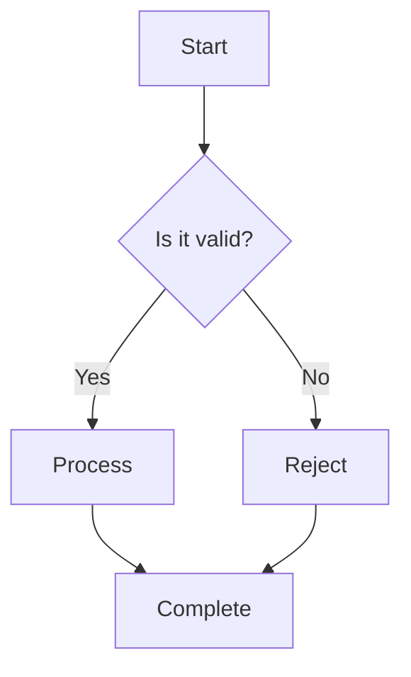
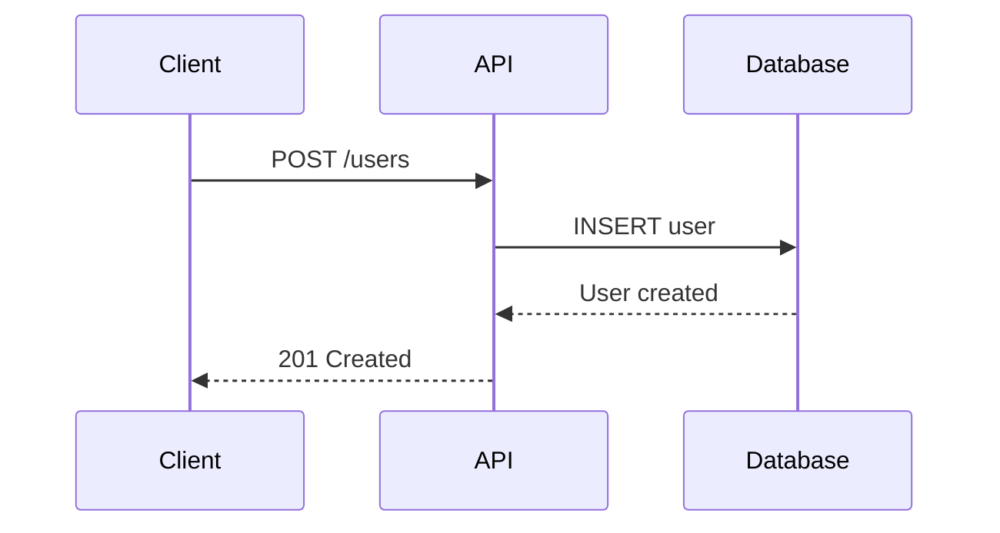
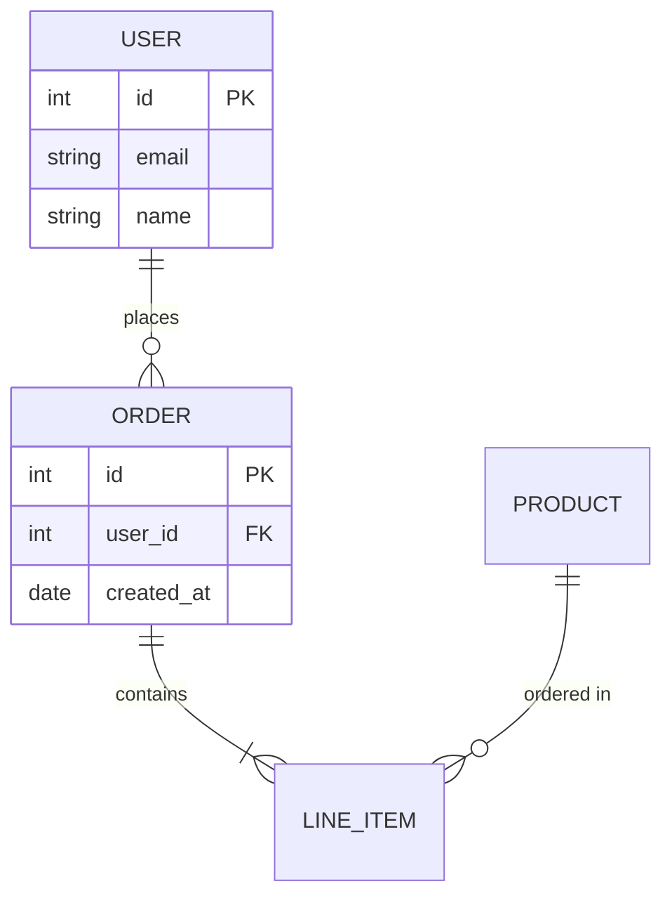
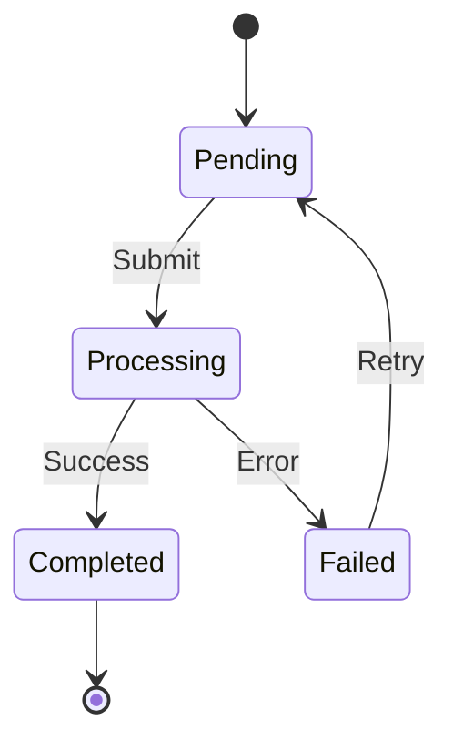
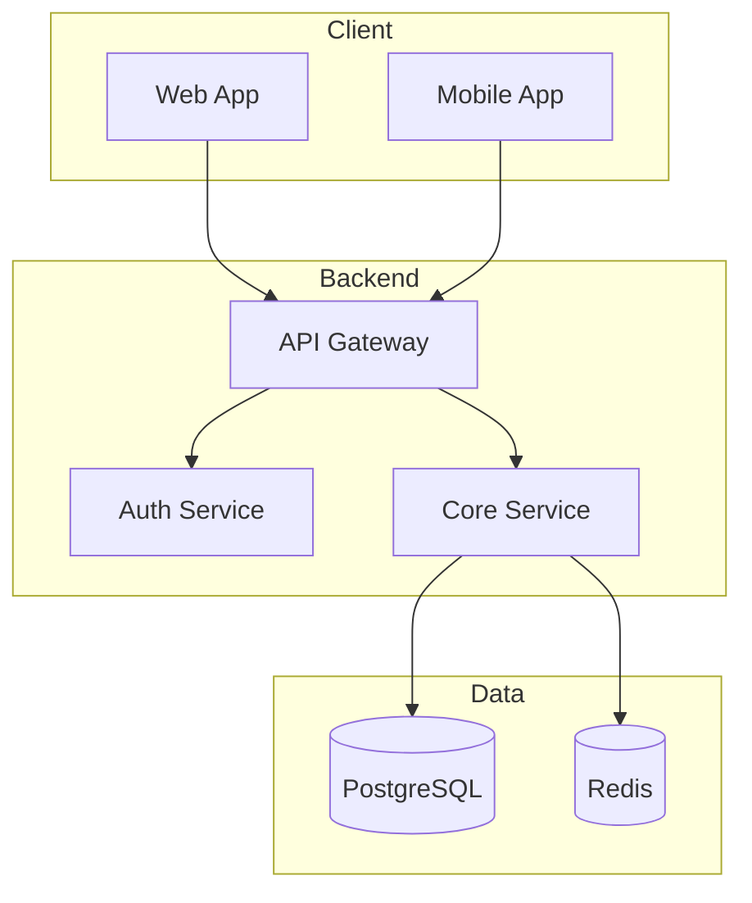

# The Definitive Guide to Building a Documentation Site with VitePress

This guide covers everything you need to build a production-ready documentation website with VitePress, including semantic search powered by embeddings, AI-powered Q&A, Mermaid diagrams, custom theming, and Cloudflare Worker integration.

---

## Table of Contents

1. [Overview](#overview)
2. [Prerequisites](#prerequisites)
3. [Project Initialization](#project-initialization)
4. [Directory Structure](#directory-structure)
5. [Package Configuration](#package-configuration)
6. [VitePress Configuration](#vitepress-configuration)
7. [Writing Documentation](#writing-documentation)
8. [Mermaid Diagrams](#mermaid-diagrams)
9. [Custom Theming & Styling](#custom-theming--styling)
10. [Semantic Search with Embeddings](#semantic-search-with-embeddings)
11. [AI-Powered Q&A Integration](#ai-powered-qa-integration)
12. [Cloudflare Worker Proxy](#cloudflare-worker-proxy)
13. [Production Deployment](#production-deployment)
14. [Environment Configuration](#environment-configuration)
15. [Troubleshooting](#troubleshooting)

---

## Overview

This guide demonstrates how to build a documentation site that includes:

- **VitePress** for static site generation with Vue 3
- **Mermaid** for interactive diagrams
- **Semantic Search** using vector embeddings
- **AI Assistant** for natural language Q&A
- **Cloudflare Workers** for secure API proxying
- **Custom Vue Components** for enhanced UX

The architecture keeps API keys secure on the server side while providing rich client-side interactivity.

---

## Prerequisites

- **Node.js** >= 20
- **Yarn** or **npm**
- **Cloudflare Account** (for Workers deployment)
- **MissionSquad API Key** (or compatible OpenAI-style embeddings API)

---

## Project Initialization

### Create Project Directory

```bash
mkdir my-docs
cd my-docs
```

### Initialize Package

```bash
yarn init -y
```

### Install Dependencies

```bash
# Core VitePress
yarn add -D vitepress typescript

# Mermaid support
yarn add mermaid vitepress-plugin-mermaid

# Image zoom (optional but recommended)
yarn add medium-zoom

# Build tooling
yarn add -D tsx dotenv fast-glob gray-matter github-slugger
yarn add -D remark-parse remark-stringify strip-markdown unified
yarn add -D @types/node

# Cloudflare Workers (for AI integration)
yarn add -D wrangler
```

---

## Directory Structure

Organize your project with the following structure:

```
my-docs/
├── .vitepress/
│   ├── config.ts              # VitePress configuration
│   └── theme/
│       ├── index.ts           # Theme entry point
│       ├── styles.css         # Global styles
│       ├── custom.css         # Custom overrides
│       ├── components/
│       │   ├── Search.vue     # Semantic search component
│       │   └── Ask.vue        # AI Q&A component
│       └── lib/
│           └── streamAsk.ts   # SSE streaming utilities
├── public/
│   ├── search-index.json      # Generated embeddings index
│   └── favicon.ico            # Site favicon
├── scripts/
│   └── buildSearchIndex.ts    # Search index generator
├── worker/
│   ├── src/
│   │   └── index.ts           # Cloudflare Worker
│   └── wrangler.toml          # Worker configuration
├── docs/                      # Your documentation content
│   ├── index.md               # Homepage
│   ├── guide/
│   │   ├── index.md
│   │   └── getting-started.md
│   └── api/
│       └── index.md
├── .env.example               # Environment template
├── package.json
├── tsconfig.json
└── env.d.ts                   # Type definitions
```

---

## Package Configuration

### package.json

```json
{
  "name": "my-docs",
  "version": "1.0.0",
  "private": true,
  "type": "module",
  "engines": {
    "node": ">=20"
  },
  "scripts": {
    "dev": "vitepress dev",
    "build": "vitepress build",
    "preview": "vitepress preview",
    "build:search": "tsx scripts/buildSearchIndex.ts",
    "build:all": "yarn build:search && yarn build",
    "worker:deploy": "wrangler deploy --config worker/wrangler.toml",
    "worker:secret": "wrangler secret put MS_API_KEY --config worker/wrangler.toml"
  },
  "devDependencies": {
    "@types/node": "^22.0.0",
    "dotenv": "^16.4.5",
    "fast-glob": "^3.3.2",
    "github-slugger": "^2.0.0",
    "gray-matter": "^4.0.3",
    "remark-parse": "^11.0.0",
    "remark-stringify": "^11.0.0",
    "strip-markdown": "^6.0.0",
    "tsx": "^4.19.0",
    "typescript": "^5.5.0",
    "unified": "^11.0.0",
    "vitepress": "^1.6.4",
    "wrangler": "^4.32.0"
  },
  "dependencies": {
    "medium-zoom": "^1.1.0",
    "mermaid": "^11.11.0",
    "vitepress-plugin-mermaid": "^2.0.17"
  }
}
```

### tsconfig.json

```json
{
  "compilerOptions": {
    "target": "ES2022",
    "module": "ESNext",
    "moduleResolution": "bundler",
    "strict": true,
    "strictNullChecks": true,
    "noImplicitAny": true,
    "esModuleInterop": true,
    "skipLibCheck": true,
    "resolveJsonModule": true,
    "isolatedModules": true,
    "noEmit": true
  },
  "include": [
    ".vitepress/**/*.ts",
    ".vitepress/**/*.vue",
    "scripts/**/*.ts",
    "worker/src/**/*.ts",
    "env.d.ts"
  ]
}
```

### env.d.ts

```typescript
/// <reference types="vitepress/client" />
```

---

## VitePress Configuration

### .vitepress/config.ts

```typescript
import { defineConfig } from 'vitepress'
import { withMermaid } from 'vitepress-plugin-mermaid'

export default withMermaid(
  defineConfig({
    title: 'My Documentation',
    description: 'Comprehensive documentation for my project',

    // Clean URLs without .html extension
    cleanUrls: true,

    // Ignore dead links during build (optional)
    ignoreDeadLinks: true,

    // Site metadata
    head: [
      ['link', { rel: 'icon', href: '/favicon.ico' }],
      ['meta', { name: 'theme-color', content: '#646cff' }],
    ],

    // Theme configuration
    themeConfig: {
      logo: '/logo.svg',

      // Top navigation
      nav: [
        { text: 'Guide', link: '/guide/' },
        { text: 'API', link: '/api/' },
        { text: 'Examples', link: '/examples/' },
      ],

      // Sidebar navigation
      sidebar: {
        '/guide/': [
          {
            text: 'Introduction',
            items: [
              { text: 'Getting Started', link: '/guide/' },
              { text: 'Installation', link: '/guide/installation' },
              { text: 'Configuration', link: '/guide/configuration' },
            ],
          },
          {
            text: 'Advanced',
            items: [
              { text: 'Deployment', link: '/guide/deployment' },
              { text: 'Customization', link: '/guide/customization' },
            ],
          },
        ],
        '/api/': [
          {
            text: 'API Reference',
            items: [
              { text: 'Overview', link: '/api/' },
              { text: 'Endpoints', link: '/api/endpoints' },
              { text: 'Authentication', link: '/api/authentication' },
            ],
          },
        ],
      },

      // Social links
      socialLinks: [
        { icon: 'github', link: 'https://github.com/your-org/your-repo' },
      ],

      // Footer
      footer: {
        message: 'Released under the MIT License.',
        copyright: 'Copyright © 2024',
      },

      // Edit link
      editLink: {
        pattern: 'https://github.com/your-org/your-repo/edit/main/:path',
        text: 'Edit this page on GitHub',
      },

      // Last updated timestamp
      lastUpdated: {
        text: 'Last updated',
        formatOptions: {
          dateStyle: 'medium',
          timeStyle: 'short',
        },
      },

      // Disable default search (we use custom semantic search)
      search: {
        provider: 'local',
      },
    },

    // Vite configuration
    vite: {
      server: {
        proxy: {
          // Proxy API calls during development
          '/api/embed': {
            target: 'https://your-worker.workers.dev',
            changeOrigin: true,
            headers: {
              Referer: '',
              Origin: '',
            },
          },
          '/api/ask': {
            target: 'https://your-worker.workers.dev',
            changeOrigin: true,
            headers: {
              Referer: '',
              Origin: '',
            },
          },
        },
      },
    },

    // Mermaid configuration
    mermaid: {
      startOnLoad: false,
      flowchart: {
        curve: 'linear',
        nodeSpacing: 30,
        rankSpacing: 40,
      },
      theme: 'default',
      themeVariables: {
        fontSize: '14px',
      },
    },
  })
)
```

---

## Writing Documentation

### Homepage (index.md)

```markdown
---
layout: home
title: Home

hero:
  name: My Project
  text: Build Amazing Things
  tagline: The complete documentation for getting started
  image:
    src: /hero-image.svg
    alt: Project Logo
  actions:
    - theme: brand
      text: Get Started
      link: /guide/
    - theme: alt
      text: View API
      link: /api/

features:
  - icon: ⚡
    title: Lightning Fast
    details: Built on modern technology for optimal performance
  - icon: 🛠️
    title: Easy to Use
    details: Simple APIs that get out of your way
  - icon: 📦
    title: Batteries Included
    details: Everything you need in one package
---
```

### Content Pages

```markdown
---
title: Getting Started
description: Learn how to set up and configure the project
---

# Getting Started

Welcome to the documentation. This guide will help you get started quickly.

## Prerequisites

Before you begin, make sure you have:

- Node.js 20 or higher
- A package manager (yarn or npm)

## Installation

Install the package using your preferred package manager:

::: code-group

```bash [yarn]
yarn add my-package
```

```bash [npm]
npm install my-package
```

:::

## Basic Usage

Here's a simple example to get you started:

```typescript
import { createClient } from 'my-package'

const client = createClient({
  apiKey: process.env.API_KEY,
})

const result = await client.doSomething()
console.log(result)
```

::: tip
Always store API keys in environment variables, never commit them to source control.
:::

::: warning
This feature requires version 2.0 or higher.
:::

::: danger
Destructive operation - this cannot be undone.
:::
```

### Frontmatter Options

```yaml
---
title: Page Title              # Browser tab title
description: Page description  # Meta description
outline: [2, 3]               # Table of contents depth
prev: false                    # Disable previous link
next:                          # Custom next link
  text: Next Section
  link: /guide/next-section
---
```

---

## Mermaid Diagrams

### Basic Usage

VitePress with the Mermaid plugin supports diagrams directly in markdown:

````markdown

````

### Sequence Diagrams

````markdown

````

### Entity Relationship Diagrams

````markdown

````

### State Diagrams

````markdown

````

### Architecture Diagrams

````markdown

````

---

## Custom Theming & Styling

### Theme Entry Point

Create `.vitepress/theme/index.ts`:

```typescript
import { h, onMounted, watch, nextTick } from 'vue'
import DefaultTheme from 'vitepress/theme'
import type { Theme } from 'vitepress'
import { useRoute } from 'vitepress'
import mediumZoom from 'medium-zoom'
import mermaid from 'mermaid'

// Import styles
import './styles.css'
import './custom.css'

// Import custom components
import Search from './components/Search.vue'
import Ask from './components/Ask.vue'

export default {
  extends: DefaultTheme,

  // Add components to layout slots
  Layout() {
    return h(DefaultTheme.Layout, null, {
      // Add search to navbar
      'nav-bar-content-after': () => h(Search),
      // Add AI assistant button
      'nav-bar-content-before': () => h(Ask),
    })
  },

  // Setup function runs on every page
  setup() {
    const route = useRoute()

    // Initialize medium-zoom for images
    const initZoom = () => {
      mediumZoom('.main img:not(.no-zoom)', {
        background: 'var(--vp-c-bg)',
      })
    }

    // Initialize Mermaid diagrams
    const initMermaid = async () => {
      await nextTick()

      mermaid.initialize({
        startOnLoad: false,
        theme: 'default',
        flowchart: {
          curve: 'linear',
          nodeSpacing: 30,
          rankSpacing: 40,
        },
      })

      // Find and render all mermaid blocks
      const elements = document.querySelectorAll('.mermaid:not([data-processed])')
      if (elements.length > 0) {
        try {
          await mermaid.run({ nodes: elements })
        } catch (error) {
          console.warn('Mermaid rendering error:', error)
        }
      }
    }

    onMounted(() => {
      initZoom()
      initMermaid()
    })

    // Re-initialize on route change
    watch(
      () => route.path,
      () => {
        nextTick(() => {
          initZoom()
          initMermaid()
        })
      }
    )
  },
} satisfies Theme
```

### Global Styles

Create `.vitepress/theme/styles.css`:

```css
/* CSS Variables for customization */
:root {
  /* Brand colors */
  --vp-c-brand-1: #646cff;
  --vp-c-brand-2: #747bff;
  --vp-c-brand-3: #535bf2;
  --vp-c-brand-soft: rgba(100, 108, 255, 0.14);

  /* Custom z-index for overlays */
  --msq-zoom-z: 9999;
}

/* Dark mode overrides */
.dark {
  --vp-c-brand-1: #747bff;
  --vp-c-brand-2: #848bff;
  --vp-c-brand-3: #646cff;
}

/* Medium zoom overlay */
.medium-zoom-overlay {
  z-index: var(--msq-zoom-z) !important;
  background-color: var(--vp-c-bg) !important;
}

.medium-zoom-image--opened {
  z-index: calc(var(--msq-zoom-z) + 1) !important;
}
```

### Custom Styles for Mermaid

Create `.vitepress/theme/custom.css`:

```css
/* Center Mermaid diagrams */
.mermaid {
  display: flex;
  justify-content: center;
  margin: 1.5rem 0;
}

.mermaid svg {
  max-width: 100%;
  height: auto !important;
}

/* Improve node visibility */
.mermaid .node rect,
.mermaid .node circle,
.mermaid .node ellipse,
.mermaid .node polygon {
  stroke-width: 2px;
}

/* Better text rendering in diagrams */
.mermaid .nodeLabel {
  font-size: 14px;
  padding: 4px 8px;
}

/* Code block improvements */
.vp-doc div[class*='language-'] {
  border-radius: 8px;
  margin: 1rem 0;
}

/* Custom container styling */
.vp-doc .custom-block {
  border-radius: 8px;
  padding: 16px 20px;
}

/* Table styling */
.vp-doc table {
  display: table;
  width: 100%;
  border-collapse: collapse;
}

.vp-doc th,
.vp-doc td {
  padding: 12px 16px;
  border: 1px solid var(--vp-c-divider);
}

.vp-doc th {
  background-color: var(--vp-c-bg-soft);
  font-weight: 600;
}

/* Responsive images */
.vp-doc img {
  max-width: 100%;
  height: auto;
  border-radius: 8px;
}
```

---

## Semantic Search with Embeddings

The search system works by:
1. Building a vector index at build time
2. Loading the index on the client
3. Embedding user queries
4. Finding similar content via cosine similarity

### Search Index Builder

Create `scripts/buildSearchIndex.ts`:

```typescript
import 'dotenv/config'
import fs from 'fs'
import path from 'path'
import fg from 'fast-glob'
import matter from 'gray-matter'
import GithubSlugger from 'github-slugger'
import { unified } from 'unified'
import remarkParse from 'remark-parse'
import stripMarkdown from 'strip-markdown'
import remarkStringify from 'remark-stringify'

// Configuration from environment
const MS_BASE_URL = process.env.MS_BASE_URL || 'https://agents.missionsquad.ai/v1'
const MS_API_KEY = process.env.MS_API_KEY
const MS_EMBED_MODEL = process.env.MS_EMBED_MODEL || 'text-embedding-3-small'

if (!MS_API_KEY) {
  console.error('MS_API_KEY environment variable is required')
  process.exit(1)
}

// Types
interface Chunk {
  id: string
  pagePath: string
  url: string
  title: string
  heading: string
  anchor: string
  content: string
  embedding?: number[]
}

interface SearchIndex {
  model: string
  embeddingModel: string
  dimensions: number
  builtAt: string
  chunks: Chunk[]
}

// Markdown to plain text converter
const markdownToPlainText = (markdown: string): string => {
  const processor = unified()
    .use(remarkParse)
    .use(stripMarkdown)
    .use(remarkStringify)

  const result = processor.processSync(markdown)
  return String(result).trim()
}

// Extract heading from markdown line
const extractHeading = (line: string): { level: number; text: string } | null => {
  const match = line.match(/^(#{1,6})\s+(.+)$/)
  if (match) {
    return {
      level: match[1].length,
      text: match[2].trim(),
    }
  }
  return null
}

// Split content into chunks by headings
const chunkByHeadings = (
  content: string,
  pagePath: string,
  pageTitle: string
): Chunk[] => {
  const slugger = new GithubSlugger()
  const lines = content.split('\n')
  const chunks: Chunk[] = []

  let currentHeading = pageTitle
  let currentAnchor = ''
  let currentContent: string[] = []

  for (const line of lines) {
    const heading = extractHeading(line)

    if (heading) {
      // Save previous chunk if it has content
      if (currentContent.length > 0) {
        const text = currentContent.join('\n').trim()
        if (text.length > 50) {
          chunks.push({
            id: `${pagePath}#${currentAnchor || 'top'}`,
            pagePath,
            url: currentAnchor ? `${pagePath}#${currentAnchor}` : pagePath,
            title: pageTitle,
            heading: currentHeading,
            anchor: currentAnchor,
            content: markdownToPlainText(text),
          })
        }
      }

      // Start new chunk
      currentHeading = heading.text
      currentAnchor = slugger.slug(heading.text)
      currentContent = []
    } else {
      currentContent.push(line)
    }
  }

  // Save final chunk
  if (currentContent.length > 0) {
    const text = currentContent.join('\n').trim()
    if (text.length > 50) {
      chunks.push({
        id: `${pagePath}#${currentAnchor || 'top'}`,
        pagePath,
        url: currentAnchor ? `${pagePath}#${currentAnchor}` : pagePath,
        title: pageTitle,
        heading: currentHeading,
        anchor: currentAnchor,
        content: markdownToPlainText(text),
      })
    }
  }

  return chunks
}

// Generate embeddings in batches
const generateEmbeddings = async (texts: string[]): Promise<number[][]> => {
  const batchSize = 64
  const allEmbeddings: number[][] = []

  for (let i = 0; i < texts.length; i += batchSize) {
    const batch = texts.slice(i, i + batchSize)
    console.log(`  Embedding batch ${Math.floor(i / batchSize) + 1}/${Math.ceil(texts.length / batchSize)}...`)

    const response = await fetch(`${MS_BASE_URL}/embeddings`, {
      method: 'POST',
      headers: {
        'Content-Type': 'application/json',
        Authorization: `Bearer ${MS_API_KEY}`,
      },
      body: JSON.stringify({
        model: MS_EMBED_MODEL,
        input: batch,
      }),
    })

    if (!response.ok) {
      const error = await response.text()
      throw new Error(`Embedding API error: ${response.status} ${error}`)
    }

    const data = await response.json()
    const embeddings = data.data.map((item: { embedding: number[] }) => item.embedding)
    allEmbeddings.push(...embeddings)
  }

  return allEmbeddings
}

// Main build function
const buildSearchIndex = async () => {
  console.log('Building search index...')

  // Find all markdown files
  const files = await fg(['**/*.md'], {
    ignore: ['node_modules/**', '.vitepress/**', 'public/**', 'README.md'],
    cwd: process.cwd(),
  })

  console.log(`Found ${files.length} markdown files`)

  // Process each file
  const allChunks: Chunk[] = []

  for (const file of files) {
    const filePath = path.join(process.cwd(), file)
    const content = fs.readFileSync(filePath, 'utf-8')

    // Parse frontmatter
    const { data: frontmatter, content: markdown } = matter(content)

    // Get page title from frontmatter or first heading
    const pageTitle = frontmatter.title || path.basename(file, '.md')

    // Convert file path to URL path
    const pagePath = '/' + file.replace(/\.md$/, '').replace(/\/index$/, '')

    // Chunk the content
    const chunks = chunkByHeadings(markdown, pagePath, pageTitle)
    allChunks.push(...chunks)
  }

  console.log(`Created ${allChunks.length} chunks`)

  // Generate embeddings for all chunks
  console.log('Generating embeddings...')
  const texts = allChunks.map((chunk) => `${chunk.heading}\n\n${chunk.content}`)
  const embeddings = await generateEmbeddings(texts)

  // Attach embeddings to chunks
  for (let i = 0; i < allChunks.length; i++) {
    allChunks[i].embedding = embeddings[i]
  }

  // Build final index
  const index: SearchIndex = {
    model: 'search-index-v1',
    embeddingModel: MS_EMBED_MODEL,
    dimensions: embeddings[0]?.length || 1536,
    builtAt: new Date().toISOString(),
    chunks: allChunks,
  }

  // Write index file
  const outputPath = path.join(process.cwd(), 'public', 'search-index.json')
  fs.mkdirSync(path.dirname(outputPath), { recursive: true })
  fs.writeFileSync(outputPath, JSON.stringify(index))

  const sizeKB = (fs.statSync(outputPath).size / 1024).toFixed(1)
  console.log(`Search index written to ${outputPath} (${sizeKB} KB)`)
  console.log(`Total chunks: ${allChunks.length}`)
  console.log(`Embedding dimensions: ${index.dimensions}`)
}

buildSearchIndex().catch((error) => {
  console.error('Build failed:', error)
  process.exit(1)
})
```

### Search Component

Create `.vitepress/theme/components/Search.vue`:

```vue
<script setup lang="ts">
import { ref, computed, onMounted, onUnmounted, watch } from 'vue'
import { useRouter } from 'vitepress'

// Types
interface Chunk {
  id: string
  pagePath: string
  url: string
  title: string
  heading: string
  anchor: string
  content: string
  embedding: number[]
}

interface SearchIndex {
  model: string
  embeddingModel: string
  dimensions: number
  builtAt: string
  chunks: Chunk[]
}

interface SearchResult {
  chunk: Chunk
  score: number
}

// State
const isOpen = ref(false)
const query = ref('')
const results = ref<SearchResult[]>([])
const selectedIndex = ref(0)
const isLoading = ref(false)
const searchIndex = ref<SearchIndex | null>(null)
const recentSearches = ref<string[]>([])

const router = useRouter()
const inputRef = ref<HTMLInputElement | null>(null)

// Load search index
const loadIndex = async () => {
  if (searchIndex.value) return

  try {
    const response = await fetch('/search-index.json')
    searchIndex.value = await response.json()
  } catch (error) {
    console.error('Failed to load search index:', error)
  }
}

// Load recent searches from localStorage
const loadRecentSearches = () => {
  try {
    const stored = localStorage.getItem('recent_searches_v1')
    if (stored) {
      recentSearches.value = JSON.parse(stored)
    }
  } catch {
    // Ignore localStorage errors
  }
}

// Save recent search
const saveRecentSearch = (search: string) => {
  const searches = recentSearches.value.filter((s) => s !== search)
  searches.unshift(search)
  recentSearches.value = searches.slice(0, 10)

  try {
    localStorage.setItem('recent_searches_v1', JSON.stringify(recentSearches.value))
  } catch {
    // Ignore localStorage errors
  }
}

// Cosine similarity between two vectors
const cosineSimilarity = (a: number[], b: number[]): number => {
  let dotProduct = 0
  let normA = 0
  let normB = 0

  for (let i = 0; i < a.length; i++) {
    dotProduct += a[i] * b[i]
    normA += a[i] * a[i]
    normB += b[i] * b[i]
  }

  return dotProduct / (Math.sqrt(normA) * Math.sqrt(normB))
}

// Get embedding for query
const getQueryEmbedding = async (text: string): Promise<number[]> => {
  const response = await fetch('/api/embed', {
    method: 'POST',
    headers: { 'Content-Type': 'application/json' },
    body: JSON.stringify({
      model: searchIndex.value?.embeddingModel || 'text-embedding-3-small',
      input: text,
    }),
  })

  if (!response.ok) {
    throw new Error('Failed to generate embedding')
  }

  const data = await response.json()
  return data.data[0].embedding
}

// Search function
const search = async (searchQuery: string) => {
  if (!searchQuery.trim() || !searchIndex.value) {
    results.value = []
    return
  }

  isLoading.value = true

  try {
    // Get embedding for query
    const queryEmbedding = await getQueryEmbedding(searchQuery)

    // Calculate similarity scores
    const scored: SearchResult[] = searchIndex.value.chunks.map((chunk) => ({
      chunk,
      score: cosineSimilarity(queryEmbedding, chunk.embedding),
    }))

    // Sort by score and take top results
    scored.sort((a, b) => b.score - a.score)
    results.value = scored.slice(0, 12)
    selectedIndex.value = 0

    // Save to recent searches
    saveRecentSearch(searchQuery)
  } catch (error) {
    console.error('Search error:', error)
    results.value = []
  } finally {
    isLoading.value = false
  }
}

// Debounced search
let searchTimeout: ReturnType<typeof setTimeout> | null = null

const debouncedSearch = (searchQuery: string) => {
  if (searchTimeout) {
    clearTimeout(searchTimeout)
  }

  searchTimeout = setTimeout(() => {
    search(searchQuery)
  }, 160)
}

// Watch query changes
watch(query, (newQuery) => {
  debouncedSearch(newQuery)
})

// Navigate to result
const goToResult = (result: SearchResult) => {
  router.go(result.chunk.url)
  close()
}

// Open search modal
const open = async () => {
  isOpen.value = true
  await loadIndex()

  // Focus input after modal opens
  setTimeout(() => {
    inputRef.value?.focus()
  }, 50)
}

// Close search modal
const close = () => {
  isOpen.value = false
  query.value = ''
  results.value = []
  selectedIndex.value = 0
}

// Keyboard navigation
const onKeydown = (e: KeyboardEvent) => {
  if (e.key === 'ArrowDown') {
    e.preventDefault()
    selectedIndex.value = Math.min(selectedIndex.value + 1, results.value.length - 1)
  } else if (e.key === 'ArrowUp') {
    e.preventDefault()
    selectedIndex.value = Math.max(selectedIndex.value - 1, 0)
  } else if (e.key === 'Enter') {
    e.preventDefault()
    if (results.value[selectedIndex.value]) {
      goToResult(results.value[selectedIndex.value])
    }
  } else if (e.key === 'Escape') {
    close()
  }
}

// Global keyboard shortcut
const onGlobalKeydown = (e: KeyboardEvent) => {
  if ((e.metaKey || e.ctrlKey) && e.key === 'k') {
    e.preventDefault()
    if (isOpen.value) {
      close()
    } else {
      open()
    }
  }
}

// Highlight query terms in text
const highlight = (text: string, maxLength = 180): string => {
  let truncated = text.length > maxLength ? text.slice(0, maxLength) + '...' : text

  if (query.value) {
    const terms = query.value.toLowerCase().split(/\s+/)
    for (const term of terms) {
      const regex = new RegExp(`(${term})`, 'gi')
      truncated = truncated.replace(regex, '<mark>$1</mark>')
    }
  }

  return truncated
}

// Lifecycle
onMounted(() => {
  loadRecentSearches()
  window.addEventListener('keydown', onGlobalKeydown)
})

onUnmounted(() => {
  window.removeEventListener('keydown', onGlobalKeydown)
})
</script>

<template>
  <!-- Search trigger button -->
  <button class="search-button" @click="open" aria-label="Search">
    <svg width="20" height="20" viewBox="0 0 20 20" fill="none">
      <path
        d="M8.5 3a5.5 5.5 0 1 0 0 11 5.5 5.5 0 0 0 0-11ZM2 8.5a6.5 6.5 0 1 1 11.436 4.23l3.857 3.857a.5.5 0 0 1-.707.707l-3.857-3.857A6.5 6.5 0 0 1 2 8.5Z"
        fill="currentColor"
      />
    </svg>
    <span class="search-label">Search</span>
    <span class="search-shortcut">
      <kbd>{{ navigator?.platform?.includes('Mac') ? '⌘' : 'Ctrl' }}</kbd>
      <kbd>K</kbd>
    </span>
  </button>

  <!-- Search modal -->
  <Teleport to="body">
    <div v-if="isOpen" class="search-overlay" @click.self="close">
      <div class="search-modal" @keydown="onKeydown">
        <!-- Search input -->
        <div class="search-input-wrapper">
          <svg class="search-icon" width="20" height="20" viewBox="0 0 20 20" fill="none">
            <path
              d="M8.5 3a5.5 5.5 0 1 0 0 11 5.5 5.5 0 0 0 0-11ZM2 8.5a6.5 6.5 0 1 1 11.436 4.23l3.857 3.857a.5.5 0 0 1-.707.707l-3.857-3.857A6.5 6.5 0 0 1 2 8.5Z"
              fill="currentColor"
            />
          </svg>
          <input
            ref="inputRef"
            v-model="query"
            type="text"
            placeholder="Search documentation..."
            class="search-input"
          />
          <span v-if="isLoading" class="search-loading">Searching...</span>
        </div>

        <!-- Results -->
        <div v-if="results.length > 0" class="search-results">
          <button
            v-for="(result, index) in results"
            :key="result.chunk.id"
            class="search-result"
            :class="{ selected: index === selectedIndex }"
            @click="goToResult(result)"
            @mouseenter="selectedIndex = index"
          >
            <div class="result-title">
              <span class="result-page">{{ result.chunk.title }}</span>
              <span v-if="result.chunk.heading !== result.chunk.title" class="result-separator">›</span>
              <span v-if="result.chunk.heading !== result.chunk.title" class="result-heading">
                {{ result.chunk.heading }}
              </span>
            </div>
            <div class="result-content" v-html="highlight(result.chunk.content)" />
            <div class="result-score">{{ (result.score * 100).toFixed(0) }}%</div>
          </button>
        </div>

        <!-- No results -->
        <div v-else-if="query && !isLoading" class="search-no-results">
          No results found for "{{ query }}"
        </div>

        <!-- Recent searches -->
        <div v-else-if="recentSearches.length > 0" class="search-recent">
          <div class="recent-header">Recent searches</div>
          <button
            v-for="search in recentSearches"
            :key="search"
            class="recent-item"
            @click="query = search"
          >
            {{ search }}
          </button>
        </div>

        <!-- Footer -->
        <div class="search-footer">
          <span class="footer-hint">
            <kbd>↑↓</kbd> to navigate
            <kbd>↵</kbd> to select
            <kbd>esc</kbd> to close
          </span>
        </div>
      </div>
    </div>
  </Teleport>
</template>

<style scoped>
.search-button {
  display: flex;
  align-items: center;
  gap: 8px;
  padding: 6px 12px;
  background: var(--vp-c-bg-soft);
  border: 1px solid var(--vp-c-divider);
  border-radius: 8px;
  cursor: pointer;
  color: var(--vp-c-text-2);
  font-size: 14px;
  transition: all 0.2s;
}

.search-button:hover {
  border-color: var(--vp-c-brand-1);
  color: var(--vp-c-text-1);
}

.search-label {
  font-weight: 500;
}

.search-shortcut {
  display: flex;
  gap: 4px;
}

.search-shortcut kbd {
  padding: 2px 6px;
  background: var(--vp-c-bg);
  border: 1px solid var(--vp-c-divider);
  border-radius: 4px;
  font-size: 12px;
  font-family: inherit;
}

.search-overlay {
  position: fixed;
  inset: 0;
  z-index: 100;
  background: rgba(0, 0, 0, 0.5);
  backdrop-filter: blur(4px);
  display: flex;
  justify-content: center;
  padding-top: 100px;
}

.search-modal {
  width: 600px;
  max-width: 90vw;
  max-height: 70vh;
  background: var(--vp-c-bg);
  border: 1px solid var(--vp-c-divider);
  border-radius: 12px;
  box-shadow: 0 20px 50px rgba(0, 0, 0, 0.3);
  display: flex;
  flex-direction: column;
  overflow: hidden;
}

.search-input-wrapper {
  display: flex;
  align-items: center;
  gap: 12px;
  padding: 16px 20px;
  border-bottom: 1px solid var(--vp-c-divider);
}

.search-icon {
  color: var(--vp-c-text-3);
  flex-shrink: 0;
}

.search-input {
  flex: 1;
  border: none;
  background: none;
  font-size: 16px;
  color: var(--vp-c-text-1);
  outline: none;
}

.search-input::placeholder {
  color: var(--vp-c-text-3);
}

.search-loading {
  font-size: 12px;
  color: var(--vp-c-text-3);
}

.search-results {
  flex: 1;
  overflow-y: auto;
  padding: 8px;
}

.search-result {
  display: block;
  width: 100%;
  padding: 12px 16px;
  text-align: left;
  background: none;
  border: none;
  border-radius: 8px;
  cursor: pointer;
  color: var(--vp-c-text-1);
}

.search-result.selected {
  background: var(--vp-c-bg-soft);
}

.result-title {
  display: flex;
  align-items: center;
  gap: 6px;
  font-weight: 500;
  margin-bottom: 4px;
}

.result-page {
  color: var(--vp-c-brand-1);
}

.result-separator {
  color: var(--vp-c-text-3);
}

.result-heading {
  color: var(--vp-c-text-2);
}

.result-content {
  font-size: 13px;
  color: var(--vp-c-text-2);
  line-height: 1.5;
}

.result-content :deep(mark) {
  background: var(--vp-c-brand-soft);
  color: var(--vp-c-brand-1);
  border-radius: 2px;
  padding: 0 2px;
}

.result-score {
  font-size: 11px;
  color: var(--vp-c-text-3);
  margin-top: 4px;
}

.search-no-results {
  padding: 40px 20px;
  text-align: center;
  color: var(--vp-c-text-3);
}

.search-recent {
  padding: 16px;
}

.recent-header {
  font-size: 12px;
  font-weight: 600;
  color: var(--vp-c-text-3);
  text-transform: uppercase;
  margin-bottom: 8px;
}

.recent-item {
  display: block;
  width: 100%;
  padding: 8px 12px;
  text-align: left;
  background: none;
  border: none;
  border-radius: 6px;
  cursor: pointer;
  color: var(--vp-c-text-2);
  font-size: 14px;
}

.recent-item:hover {
  background: var(--vp-c-bg-soft);
  color: var(--vp-c-text-1);
}

.search-footer {
  padding: 12px 20px;
  border-top: 1px solid var(--vp-c-divider);
  display: flex;
  justify-content: space-between;
  align-items: center;
}

.footer-hint {
  display: flex;
  gap: 12px;
  font-size: 12px;
  color: var(--vp-c-text-3);
}

.footer-hint kbd {
  padding: 2px 6px;
  background: var(--vp-c-bg-soft);
  border: 1px solid var(--vp-c-divider);
  border-radius: 4px;
  font-family: inherit;
}
</style>
```

---

## AI-Powered Q&A Integration

### Streaming Utility

Create `.vitepress/theme/lib/streamAsk.ts`:

```typescript
export interface Message {
  role: 'system' | 'user' | 'assistant'
  content: string
}

export interface AskOptions {
  model: string
  messages: Message[]
}

export interface StreamHandlers {
  onToken: (text: string) => void
  onError?: (err: unknown) => void
  onDone?: () => void
}

export async function streamAsk(
  body: AskOptions,
  handlers: StreamHandlers
): Promise<void> {
  const { onToken, onError, onDone } = handlers

  const response = await fetch('/api/ask', {
    method: 'POST',
    headers: { 'Content-Type': 'application/json' },
    body: JSON.stringify({ ...body, stream: true }),
  })

  if (!response.ok) {
    const error = await response.text()
    onError?.(new Error(`API error: ${response.status} ${error}`))
    return
  }

  const reader = response.body?.getReader()
  if (!reader) {
    onError?.(new Error('No response body'))
    return
  }

  const decoder = new TextDecoder()
  let buffer = ''

  try {
    while (true) {
      const { done, value } = await reader.read()

      if (done) {
        onDone?.()
        break
      }

      buffer += decoder.decode(value, { stream: true })

      // Process complete SSE frames
      const frames = buffer.split('\n\n')
      buffer = frames.pop() || ''

      for (const frame of frames) {
        if (!frame.startsWith('data: ')) continue

        const data = frame.slice(6)
        if (data === '[DONE]') {
          onDone?.()
          return
        }

        try {
          const json = JSON.parse(data)
          const token = json.choices?.[0]?.delta?.content
          if (token) {
            onToken(token)
          }
        } catch {
          // Ignore parse errors for incomplete frames
        }
      }
    }
  } catch (error) {
    onError?.(error)
  } finally {
    reader.releaseLock()
  }
}
```

### Ask AI Component

Create `.vitepress/theme/components/Ask.vue`:

```vue
<script setup lang="ts">
import { ref, nextTick, onMounted, onUnmounted } from 'vue'
import { streamAsk, type Message } from '../lib/streamAsk'

// Types
interface Chunk {
  url: string
  title: string
  heading: string
  content: string
  embedding: number[]
}

interface SearchIndex {
  embeddingModel: string
  chunks: Chunk[]
}

// State
const isOpen = ref(false)
const question = ref('')
const answer = ref('')
const isLoading = ref(false)
const searchIndex = ref<SearchIndex | null>(null)
const answerRef = ref<HTMLDivElement | null>(null)

// Load search index
const loadIndex = async () => {
  if (searchIndex.value) return

  try {
    const response = await fetch('/search-index.json')
    searchIndex.value = await response.json()
  } catch (error) {
    console.error('Failed to load search index:', error)
  }
}

// Cosine similarity
const cosineSimilarity = (a: number[], b: number[]): number => {
  let dotProduct = 0
  let normA = 0
  let normB = 0

  for (let i = 0; i < a.length; i++) {
    dotProduct += a[i] * b[i]
    normA += a[i] * a[i]
    normB += b[i] * b[i]
  }

  return dotProduct / (Math.sqrt(normA) * Math.sqrt(normB))
}

// Get query embedding
const getQueryEmbedding = async (text: string): Promise<number[]> => {
  const response = await fetch('/api/embed', {
    method: 'POST',
    headers: { 'Content-Type': 'application/json' },
    body: JSON.stringify({
      model: searchIndex.value?.embeddingModel || 'text-embedding-3-small',
      input: text,
    }),
  })

  if (!response.ok) {
    throw new Error('Failed to generate embedding')
  }

  const data = await response.json()
  return data.data[0].embedding
}

// Find relevant context
const findContext = async (query: string): Promise<string> => {
  if (!searchIndex.value) return ''

  const queryEmbedding = await getQueryEmbedding(query)

  const scored = searchIndex.value.chunks.map((chunk) => ({
    chunk,
    score: cosineSimilarity(queryEmbedding, chunk.embedding),
  }))

  scored.sort((a, b) => b.score - a.score)
  const topChunks = scored.slice(0, 6)

  return topChunks
    .map((item) => {
      return `[Source: ${item.chunk.url}]\n${item.chunk.title} > ${item.chunk.heading}\n${item.chunk.content}`
    })
    .join('\n\n---\n\n')
}

// Ask the AI
const ask = async () => {
  if (!question.value.trim() || isLoading.value) return

  await loadIndex()

  isLoading.value = true
  answer.value = ''

  try {
    // Get relevant context
    const context = await findContext(question.value)

    // Build messages
    const messages: Message[] = [
      {
        role: 'system',
        content: `You are a helpful assistant answering questions about the documentation. Use the following context to answer the user's question. If the context doesn't contain relevant information, say so. Always cite sources when possible using the URL provided in [Source: url] tags.

Context:
${context}`,
      },
      {
        role: 'user',
        content: question.value,
      },
    ]

    // Stream the response
    await streamAsk(
      {
        model: 'gpt-4o-mini', // or your preferred model
        messages,
      },
      {
        onToken: (token) => {
          answer.value += token
          // Auto-scroll to bottom
          nextTick(() => {
            if (answerRef.value) {
              answerRef.value.scrollTop = answerRef.value.scrollHeight
            }
          })
        },
        onError: (error) => {
          console.error('Stream error:', error)
          answer.value = 'Sorry, an error occurred. Please try again.'
        },
        onDone: () => {
          isLoading.value = false
        },
      }
    )
  } catch (error) {
    console.error('Ask error:', error)
    answer.value = 'Sorry, an error occurred. Please try again.'
    isLoading.value = false
  }
}

// Toggle panel
const toggle = () => {
  isOpen.value = !isOpen.value
}

// Handle keyboard shortcut
const onKeydown = (e: KeyboardEvent) => {
  if (e.key === 'Enter' && !e.shiftKey) {
    e.preventDefault()
    ask()
  }
}
</script>

<template>
  <!-- Trigger button -->
  <button class="ask-button" @click="toggle">
    <svg width="20" height="20" viewBox="0 0 24 24" fill="none" stroke="currentColor" stroke-width="2">
      <circle cx="12" cy="12" r="10" />
      <path d="M9.09 9a3 3 0 0 1 5.83 1c0 2-3 3-3 3" />
      <path d="M12 17h.01" />
    </svg>
    <span>Ask AI</span>
  </button>

  <!-- Panel -->
  <Teleport to="body">
    <Transition name="slide">
      <div v-if="isOpen" class="ask-panel">
        <div class="ask-header">
          <h3>Ask AI Assistant</h3>
          <button class="close-button" @click="toggle">
            <svg width="20" height="20" viewBox="0 0 24 24" fill="none" stroke="currentColor" stroke-width="2">
              <path d="M18 6 6 18M6 6l12 12" />
            </svg>
          </button>
        </div>

        <div class="ask-content">
          <!-- Answer display -->
          <div v-if="answer || isLoading" ref="answerRef" class="answer-box">
            <div class="answer-text">{{ answer }}</div>
            <div v-if="isLoading && !answer" class="answer-loading">
              Thinking...
            </div>
          </div>

          <!-- Placeholder -->
          <div v-else class="answer-placeholder">
            Ask a question about the documentation
          </div>
        </div>

        <div class="ask-input-wrapper">
          <input
            v-model="question"
            type="text"
            placeholder="Type your question..."
            class="ask-input"
            :disabled="isLoading"
            @keydown="onKeydown"
          />
          <button
            class="ask-submit"
            :disabled="!question.trim() || isLoading"
            @click="ask"
          >
            <svg width="20" height="20" viewBox="0 0 24 24" fill="none" stroke="currentColor" stroke-width="2">
              <path d="m22 2-7 20-4-9-9-4 20-7Z" />
            </svg>
          </button>
        </div>
      </div>
    </Transition>
  </Teleport>
</template>

<style scoped>
.ask-button {
  display: flex;
  align-items: center;
  gap: 6px;
  padding: 6px 12px;
  background: var(--vp-c-brand-soft);
  border: 1px solid var(--vp-c-brand-1);
  border-radius: 8px;
  cursor: pointer;
  color: var(--vp-c-brand-1);
  font-size: 14px;
  font-weight: 500;
  transition: all 0.2s;
}

.ask-button:hover {
  background: var(--vp-c-brand-1);
  color: white;
}

.ask-panel {
  position: fixed;
  top: var(--vp-nav-height, 64px);
  right: 0;
  width: 460px;
  max-width: 100vw;
  height: calc(100vh - var(--vp-nav-height, 64px));
  background: var(--vp-c-bg);
  border-left: 1px solid var(--vp-c-divider);
  box-shadow: -4px 0 20px rgba(0, 0, 0, 0.1);
  display: flex;
  flex-direction: column;
  z-index: 50;
}

.ask-header {
  display: flex;
  justify-content: space-between;
  align-items: center;
  padding: 16px 20px;
  border-bottom: 1px solid var(--vp-c-divider);
}

.ask-header h3 {
  margin: 0;
  font-size: 16px;
  font-weight: 600;
}

.close-button {
  padding: 4px;
  background: none;
  border: none;
  cursor: pointer;
  color: var(--vp-c-text-3);
  border-radius: 4px;
}

.close-button:hover {
  background: var(--vp-c-bg-soft);
  color: var(--vp-c-text-1);
}

.ask-content {
  flex: 1;
  overflow-y: auto;
  padding: 20px;
}

.answer-box {
  background: var(--vp-c-bg-soft);
  border-radius: 8px;
  padding: 16px;
  max-height: 100%;
  overflow-y: auto;
}

.answer-text {
  white-space: pre-wrap;
  line-height: 1.6;
  color: var(--vp-c-text-1);
}

.answer-loading {
  color: var(--vp-c-text-3);
  font-style: italic;
}

.answer-placeholder {
  color: var(--vp-c-text-3);
  text-align: center;
  padding: 40px 20px;
}

.ask-input-wrapper {
  display: flex;
  gap: 8px;
  padding: 16px 20px;
  border-top: 1px solid var(--vp-c-divider);
}

.ask-input {
  flex: 1;
  padding: 10px 14px;
  background: var(--vp-c-bg-soft);
  border: 1px solid var(--vp-c-divider);
  border-radius: 8px;
  font-size: 14px;
  color: var(--vp-c-text-1);
  outline: none;
}

.ask-input:focus {
  border-color: var(--vp-c-brand-1);
}

.ask-input:disabled {
  opacity: 0.6;
}

.ask-submit {
  padding: 10px 14px;
  background: var(--vp-c-brand-1);
  border: none;
  border-radius: 8px;
  cursor: pointer;
  color: white;
  transition: all 0.2s;
}

.ask-submit:hover:not(:disabled) {
  background: var(--vp-c-brand-2);
}

.ask-submit:disabled {
  opacity: 0.5;
  cursor: not-allowed;
}

/* Slide transition */
.slide-enter-active,
.slide-leave-active {
  transition: transform 0.3s ease;
}

.slide-enter-from,
.slide-leave-to {
  transform: translateX(100%);
}
</style>
```

---

## Cloudflare Worker Proxy

The Worker keeps your API key secure and handles CORS and SSE streaming.

### worker/wrangler.toml

```toml
name = "docs-proxy"
main = "src/index.ts"
compatibility_date = "2024-06-01"
workers_dev = true

[vars]
MS_BASE_URL = "https://agents.missionsquad.ai/v1"
# MS_API_KEY is stored as a secret, not here

# Production routes (uncomment and configure for your domain)
# [[routes]]
# pattern = "docs.yourdomain.com/api/ask*"
# zone_name = "yourdomain.com"
#
# [[routes]]
# pattern = "docs.yourdomain.com/api/embed*"
# zone_name = "yourdomain.com"
```

### worker/src/index.ts

```typescript
export interface Env {
  MS_BASE_URL: string
  MS_API_KEY: string
}

export default {
  async fetch(request: Request, env: Env): Promise<Response> {
    const url = new URL(request.url)

    // Handle CORS preflight
    if (request.method === 'OPTIONS') {
      return new Response(null, {
        headers: {
          'Access-Control-Allow-Origin': '*',
          'Access-Control-Allow-Methods': 'POST, OPTIONS',
          'Access-Control-Allow-Headers': 'Content-Type',
        },
      })
    }

    // Only allow POST requests
    if (request.method !== 'POST') {
      return new Response('Method not allowed', { status: 405 })
    }

    // Normalize base URL
    let baseUrl = env.MS_BASE_URL
    if (!baseUrl.endsWith('/v1')) {
      baseUrl = baseUrl.replace(/\/$/, '') + '/v1'
    }

    // Route to appropriate upstream endpoint
    let upstreamUrl: string
    let isStreaming = false

    if (url.pathname === '/api/embed') {
      upstreamUrl = `${baseUrl}/embeddings`
    } else if (url.pathname === '/api/ask') {
      upstreamUrl = `${baseUrl}/chat/completions`
      isStreaming = true
    } else {
      return new Response('Not found', { status: 404 })
    }

    // Forward the request
    const upstreamResponse = await fetch(upstreamUrl, {
      method: 'POST',
      headers: {
        'Content-Type': 'application/json',
        Authorization: `Bearer ${env.MS_API_KEY}`,
      },
      body: request.body,
    })

    // Build response headers
    const headers = new Headers()
    headers.set('Access-Control-Allow-Origin', '*')

    if (isStreaming) {
      // SSE-specific headers
      headers.set('Content-Type', 'text/event-stream')
      headers.set('Cache-Control', 'no-cache, no-transform')
      headers.set('Connection', '')
      headers.set('X-Accel-Buffering', 'no')
    } else {
      headers.set('Content-Type', 'application/json')
    }

    return new Response(upstreamResponse.body, {
      status: upstreamResponse.status,
      headers,
    })
  },
}
```

### Deploying the Worker

```bash
# Deploy the worker
yarn worker:deploy

# Set the API key as a secret
yarn worker:secret
# Enter your API key when prompted
```

---

## Production Deployment

### Build the Site

```bash
# Build search index (requires MS_API_KEY)
yarn build:search

# Build the static site
yarn build

# Or build both
yarn build:all
```

### Nginx Configuration

Create `nginx.conf` for serving the static site with Worker proxy:

```nginx
server {
    listen 80;
    server_name docs.yourdomain.com;
    return 301 https://$host$request_uri;
}

server {
    listen 443 ssl http2;
    server_name docs.yourdomain.com;

    # SSL certificates (Let's Encrypt example)
    ssl_certificate /etc/letsencrypt/live/docs.yourdomain.com/fullchain.pem;
    ssl_certificate_key /etc/letsencrypt/live/docs.yourdomain.com/privkey.pem;

    # Static files root
    root /srv/www/docs;
    index index.html;

    # Clean URLs - try .html extension
    location / {
        try_files $uri $uri.html $uri/ =404;
    }

    # Proxy API requests to Cloudflare Worker
    location /api/ {
        # Critical for SSE streaming
        proxy_buffering off;
        proxy_cache off;
        proxy_read_timeout 3600s;
        chunked_transfer_encoding off;

        # Prevent upstream buffering
        proxy_set_header X-Accel-Buffering no;
        proxy_set_header Accept-Encoding "";
        proxy_set_header Connection "";

        # Forward to Worker
        resolver 1.1.1.1 valid=30s;
        set $worker "docs-proxy.your-account.workers.dev";
        proxy_pass https://$worker;
        proxy_ssl_server_name on;
        proxy_set_header Host $worker;
    }

    # Cache static assets
    location ~* \.(js|css|png|jpg|jpeg|gif|ico|svg|woff|woff2)$ {
        expires 1y;
        add_header Cache-Control "public, immutable";
    }

    # Cache search index with shorter TTL
    location = /search-index.json {
        expires 1h;
        add_header Cache-Control "public";
    }
}
```

### Docker Deployment

Create `Dockerfile`:

```dockerfile
FROM node:20-alpine AS builder

WORKDIR /app
COPY package.json yarn.lock ./
RUN yarn install --frozen-lockfile

COPY . .
RUN yarn build:all

FROM nginx:alpine

COPY --from=builder /app/.vitepress/dist /usr/share/nginx/html
COPY nginx.conf /etc/nginx/conf.d/default.conf

EXPOSE 80
CMD ["nginx", "-g", "daemon off;"]
```

---

## Environment Configuration

### .env.example

```bash
# MissionSquad API Configuration
# Base URL for the API (or any OpenAI-compatible API)
MS_BASE_URL=https://agents.missionsquad.ai/v1

# API key for authentication (keep secret!)
MS_API_KEY=msq-REPLACE_ME

# Embedding model to use
MS_EMBED_MODEL=text-embedding-3-small
```

### Setting Up Secrets

1. **Local Development**: Copy `.env.example` to `.env` and fill in values
2. **CI/CD**: Set environment variables in your CI system
3. **Cloudflare Worker**: Use `wrangler secret put MS_API_KEY`

---

## Troubleshooting

### Common Issues

#### Search Not Working

1. **Check search index exists**: Ensure `public/search-index.json` was generated
2. **Verify API connectivity**: Test `/api/embed` endpoint manually
3. **Check console errors**: Look for CORS or network errors

```bash
# Rebuild search index
yarn build:search

# Check if index was created
ls -la public/search-index.json
```

#### Mermaid Diagrams Not Rendering

1. **Check plugin configuration**: Ensure `withMermaid` wraps your config
2. **Verify CSS**: Check that custom.css is imported
3. **Console errors**: Look for Mermaid initialization errors

```typescript
// Verify config.ts structure
export default withMermaid(
  defineConfig({
    // ... your config
  })
)
```

#### SSE Streaming Issues

1. **Nginx buffering**: Ensure `proxy_buffering off` is set
2. **Worker headers**: Verify `X-Accel-Buffering: no` header
3. **Timeout**: Increase `proxy_read_timeout` for long responses

#### Build Errors

```bash
# Clear VitePress cache
rm -rf .vitepress/cache

# Reinstall dependencies
rm -rf node_modules yarn.lock
yarn install

# Rebuild
yarn build
```

### Development Tips

1. **Hot Reload**: VitePress supports hot module replacement
2. **Local API Testing**: Use Vite proxy for development
3. **Search Index**: Only rebuild when content changes significantly

```bash
# Start dev server with full features
yarn dev

# Preview production build locally
yarn build && yarn preview
```

---

## Summary

This guide covered building a complete documentation site with:

- **VitePress** for fast static site generation
- **Mermaid** for interactive diagrams
- **Semantic Search** using vector embeddings
- **AI Q&A** with streaming responses
- **Cloudflare Workers** for secure API proxying
- **Production deployment** with Nginx

The architecture ensures API keys stay secure on the server while providing rich client-side interactivity. The search system uses pre-built embeddings for fast queries, and the AI assistant provides contextual answers from your documentation.

For more information:
- [VitePress Documentation](https://vitepress.dev/)
- [Mermaid Documentation](https://mermaid.js.org/)
- [Cloudflare Workers Documentation](https://developers.cloudflare.com/workers/)
- [MissionSquad API](https://docs.missionsquad.ai/)
