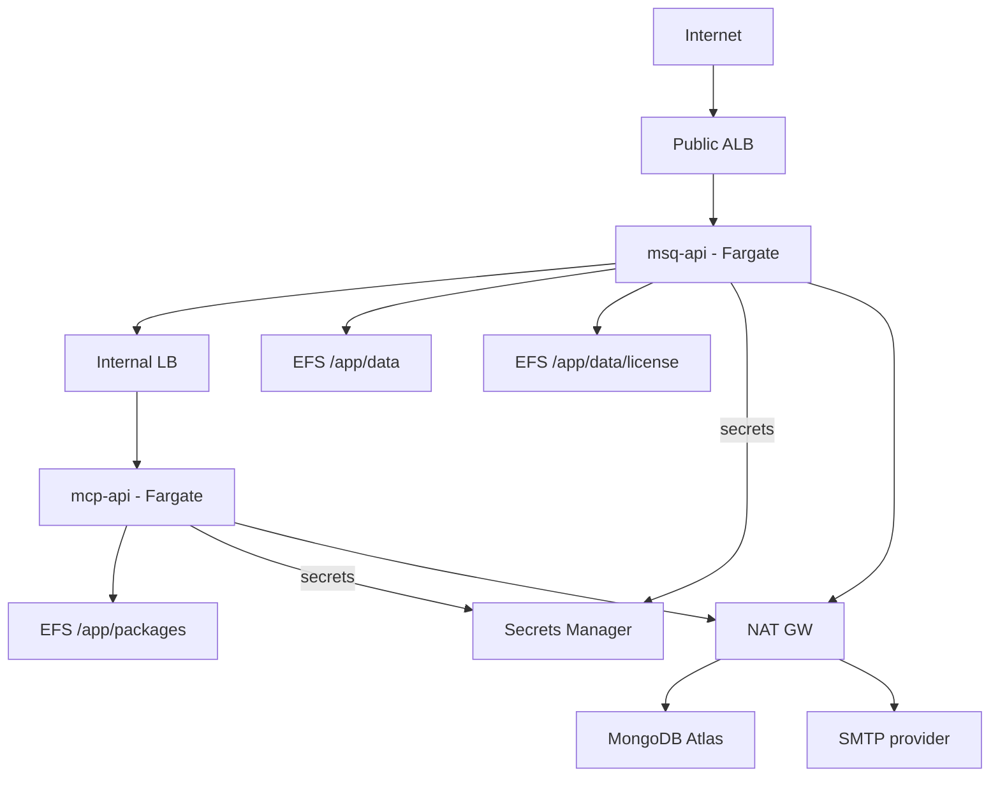
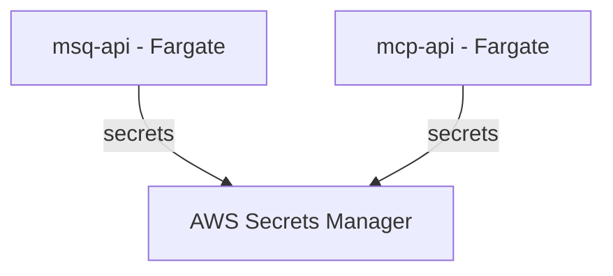
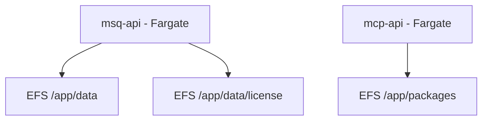
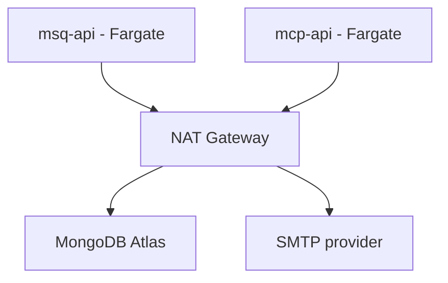
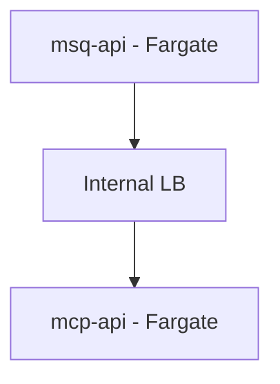
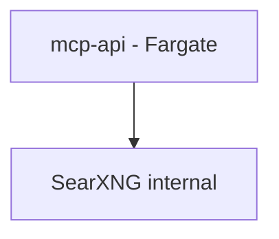

# Mission Squad Platform — AWS Deployment

Audience: Cloud operators deploying the Mission Squad Platform on AWS. This guide provides a production‑grade reference using:
- Amazon ECS on AWS Fargate for stateless services
- AWS Secrets Manager for secrets
- Private subnets with NAT for private egress (or Interface Endpoints/PrivateLink)
- Internal Load Balancer (ALB or NLB) for MCP (private endpoint)
- Amazon EFS for persistent data mounts
- CloudWatch Logs and Container Insights for monitoring

This guide provides step-by-step commands to deploy the platform on AWS with current images and environment settings. Create all required secrets in Secrets Manager before deploying.

Related:
- General Docker/Compose hosting: [Hosting](/hosting/)
- Platform UI: [Getting Started](/platform/getting-started)
- API Overview: [API](/api/)
- Endpoint Index: [Endpoint Index](/api/reference/endpoint-index)

## References (AWS Documentation)

Validated AWS docs referenced in this guide:
- ECS task definitions: https://docs.aws.amazon.com/AmazonECS/latest/developerguide/task_definitions.html
- Task definition parameters (Fargate): https://docs.aws.amazon.com/AmazonECS/latest/developerguide/task_definition_parameters.html
- EFS volumes in ECS task definition: https://docs.aws.amazon.com/AmazonECS/latest/developerguide/specify-efs-config.html
- Pass sensitive data to ECS containers (Secrets Manager, Parameter Store): https://docs.aws.amazon.com/AmazonECS/latest/developerguide/specifying-sensitive-data.html
- Task execution role: https://docs.aws.amazon.com/AmazonECS/latest/developerguide/task_execution_IAM_role.html
- Fargate task networking (awsvpc, subnets, SGs, NAT): https://docs.aws.amazon.com/AmazonECS/latest/developerguide/fargate-task-networking.html
- Application Load Balancer with ECS: https://docs.aws.amazon.com/AmazonECS/latest/developerguide/alb.html
- Network Load Balancer with ECS: https://docs.aws.amazon.com/AmazonECS/latest/developerguide/nlb.html
- Route logs to CloudWatch (awslogs): https://docs.aws.amazon.com/AmazonECS/latest/developerguide/using_awslogs.html
- ECS service discovery (optional): https://docs.aws.amazon.com/AmazonECS/latest/developerguide/service-discovery.html
- ECS CloudFormation examples: https://docs.aws.amazon.com/AmazonECS/latest/developerguide/working-with-templates.html
- Amazon ECR VPC endpoints (PrivateLink): https://docs.aws.amazon.com/AmazonECR/latest/userguide/vpc-endpoints.html

---

## 1) Architecture

### Overview

#### Overview



- Services
  - msq-api (public via internet-facing ALB)
  - mcp-api (private via internal LB; not publicly exposed)
- Networking
  - ECS tasks in private subnets with `awsvpc` networking (required for Fargate)
  - Public ALB fronting `msq-api`
  - Internal load balancer fronting `mcp-api`
    - Choose internal ALB (DNS-based) or internal NLB (if you require stable private IPs)
- Storage
  - Amazon EFS mounted into ECS tasks:
    - `/app/data` (API data)
    - `/app/data/license` (license artifacts)
    - `/app/packages` (MCP packages)
- Secrets
  - AWS Secrets Manager: `MONGO_PASS`, `SECRETS_KEY`, `JWT_SECRET`, `ADMIN_PASSWORD`, `SMTP_PASS`

---

## 2) GCP → AWS service mapping

- Cloud Run (Gen2) → ECS on Fargate (serverless containers)
- Secret Manager → AWS Secrets Manager
- Serverless VPC Access Connector → ECS tasks in private subnets + NAT or Interface VPC Endpoints (AWS PrivateLink)
- GCP Internal HTTP Load Balancer (ILB) → Internal ALB (DNS) or Internal NLB (static private IPs)
- Cloud Storage bucket mounts → Amazon EFS (POSIX file system; S3 is object storage, not a mount)
- Artifact Registry → Amazon ECR

---

## 3) Prerequisites

- awscli v2 installed and authenticated:
  ```bash
  aws sts get-caller-identity
  ```
- Identified:
  - AWS account ID, region
  - VPC ID
  - Two public subnets (for the internet-facing ALB)
  - Two private subnets (for Fargate tasks and internal LB)
- MongoDB (Atlas recommended):
  - SRV URL or standard URI with replicaSet
  - Connectivity pattern:
    - Preferred: PrivateLink (Interface Endpoint) per MongoDB Atlas docs (perform provider-side steps in Atlas)
    - Alternative: NAT egress with allow-listed EIPs in Atlas
- Domains/TLS (optional):
  - ACM certificate for API domain if terminating TLS on ALB
- Quotas:
  - Fargate capacity, EFS mount targets per AZ, ELB limits

Export baseline variables (replace placeholders explicitly):
```bash
export AWS_REGION="us-west-2"
export ACCOUNT_ID="$(aws sts get-caller-identity --query Account --output text)"
export VPC_ID="vpc-xxxxxxxx"

# Subnets (examples; use your IDs)
export SUBNET_PUBLIC_AZ1="subnet-aaaaaaaa"
export SUBNET_PUBLIC_AZ2="subnet-bbbbbbbb"
export SUBNET_PRIVATE_AZ1="subnet-cccccccc"
export SUBNET_PRIVATE_AZ2="subnet-dddddddd"

# Names
export ENVIRONMENT="prod"
export CLUSTER_NAME="${ENVIRONMENT}-msq"
export EFS_NAME="${ENVIRONMENT}-msq-efs"

# Images (direct GHCR or mirror to ECR; see section 4)
export MSQ_API_IMAGE="ghcr.io/missionsquad/missionsquad-api:1.40.0"
export MCP_API_IMAGE="ghcr.io/missionsquad/mcp-api:1.7.0"

# Log groups
export LOG_GROUP_API="/aws/ecs/${ENVIRONMENT}-msq-api"
export LOG_GROUP_MCP="/aws/ecs/${ENVIRONMENT}-mcp-api"
```

---

## 4) Images: GHCR or mirror to ECR

Option A (simpler): Use GHCR tags directly.

Option B (recommended): Mirror to ECR:
```bash
aws ecr create-repository --repository-name missionsquad-api || true
aws ecr create-repository --repository-name mcp-api || true

aws ecr get-login-password --region "$AWS_REGION" \
| docker login --username AWS --password-stdin "${ACCOUNT_ID}.dkr.ecr.${AWS_REGION}.amazonaws.com"

docker pull ghcr.io/missionsquad/missionsquad-api:1.40.0
docker pull ghcr.io/missionsquad/mcp-api:1.7.0

docker tag ghcr.io/missionsquad/missionsquad-api:1.40.0 \
  "${ACCOUNT_ID}.dkr.ecr.${AWS_REGION}.amazonaws.com/missionsquad-api:1.40.0"
docker tag ghcr.io/missionsquad/mcp-api:1.7.0 \
  "${ACCOUNT_ID}.dkr.ecr.${AWS_REGION}.amazonaws.com/mcp-api:1.7.0"

docker push "${ACCOUNT_ID}.dkr.ecr.${AWS_REGION}.amazonaws.com/missionsquad-api:1.40.0"
docker push "${ACCOUNT_ID}.dkr.ecr.${AWS_REGION}.amazonaws.com/mcp-api:1.7.0"

# If mirrored:
# export MSQ_API_IMAGE="${ACCOUNT_ID}.dkr.ecr.${AWS_REGION}.amazonaws.com/missionsquad-api:1.40.0"
# export MCP_API_IMAGE="${ACCOUNT_ID}.dkr.ecr.${AWS_REGION}.amazonaws.com/mcp-api:1.7.0"
```
ECR PrivateLink (optional): https://docs.aws.amazon.com/AmazonECR/latest/userguide/vpc-endpoints.html

---

## 5) Secrets (AWS Secrets Manager)

Create these secrets. Names are examples; use the same names in task definitions:
- `MONGO_PASS_PROD`
- `SECRETS_KEY_PROD` (used for both MCP `SECRETS_KEY` and API `USER_SECRET_KEY`)
- `JWT_SECRET_PROD`
- `ADMIN_PASSWORD_PROD`
- `SMTP_PASS_PROD`

```bash
aws secretsmanager create-secret --name MONGO_PASS_PROD --secret-string 'your-mongo-password'
aws secretsmanager create-secret --name SECRETS_KEY_PROD --secret-string 'openssl rand -hex 32'
aws secretsmanager create-secret --name JWT_SECRET_PROD --secret-string 'openssl rand -hex 32'
aws secretsmanager create-secret --name ADMIN_PASSWORD_PROD --secret-string 'your-admin-password'
aws secretsmanager create-secret --name SMTP_PASS_PROD --secret-string 'your-smtp-pass'

# ARNs for use in task definitions:
export ARN_MONGO_PASS="$(aws secretsmanager describe-secret --secret-id MONGO_PASS_PROD --query ARN --output text)"
export ARN_SECRETS_KEY="$(aws secretsmanager describe-secret --secret-id SECRETS_KEY_PROD --query ARN --output text)"
export ARN_JWT_SECRET="$(aws secretsmanager describe-secret --secret-id JWT_SECRET_PROD --query ARN --output text)"
export ARN_ADMIN_PASSWORD="$(aws secretsmanager describe-secret --secret-id ADMIN_PASSWORD_PROD --query ARN --output text)"
export ARN_SMTP_PASS="$(aws secretsmanager describe-secret --secret-id SMTP_PASS_PROD --query ARN --output text)"
```



Docs: https://docs.aws.amazon.com/AmazonECS/latest/developerguide/specifying-sensitive-data.html

---

## 6) Storage: Amazon EFS and IAM

Create an encrypted EFS file system and mount targets in private subnets:
```bash
export EFS_ID=$(aws efs create-file-system --performance-mode generalPurpose \
  --encrypted --tags Key=Name,Value="$EFS_NAME" \
  --query FileSystemId --output text)

# EFS SG allows NFS (2049) from ECS tasks SG (created below)
export SG_EFS_ID=$(aws ec2 create-security-group \
  --group-name "${ENVIRONMENT}-efs-sg" --description "${ENVIRONMENT} EFS SG" --vpc-id "$VPC_ID" \
  --query GroupId --output text)

aws efs create-mount-target --file-system-id "$EFS_ID" --subnet-id "$SUBNET_PRIVATE_AZ1" --security-groups "$SG_EFS_ID"
aws efs create-mount-target --file-system-id "$EFS_ID" --subnet-id "$SUBNET_PRIVATE_AZ2" --security-groups "$SG_EFS_ID"
```

Create EFS Access Points (UID/GID adapted to your base images; 1000:1000 is common for Node images):
```bash
# /app/data
export AP_DATA=$(aws efs create-access-point --file-system-id "$EFS_ID" \
  --posix-user Uid=1000,Gid=1000 \
  --root-directory "Path=/app/data,CreationInfo={OwnerUid=1000,OwnerGid=1000,Permissions=0775}" \
  --query AccessPointId --output text)

# /app/data/license
export AP_LICENSE=$(aws efs create-access-point --file-system-id "$EFS_ID" \
  --posix-user Uid=1000,Gid=1000 \
  --root-directory "Path=/app/data/license,CreationInfo={OwnerUid=1000,OwnerGid=1000,Permissions=0775}" \
  --query AccessPointId --output text)

# /app/packages
export AP_PACKAGES=$(aws efs create-access-point --file-system-id "$EFS_ID" \
  --posix-user Uid=1000,Gid=1000 \
  --root-directory "Path=/app/packages,CreationInfo={OwnerUid=1000,OwnerGid=1000,Permissions=0775}" \
  --query AccessPointId --output text)
```



ECS EFS config (authorization + transit encryption): https://docs.aws.amazon.com/AmazonECS/latest/developerguide/specify-efs-config.html

---

## 7) Networking: Security Groups and Load Balancers

#### Private egress



#### Internal routing



Security groups:
```bash
# ECS tasks SG (allow from ALBs; egress open to NAT)
export SG_TASKS_ID=$(aws ec2 create-security-group \
  --group-name "${ENVIRONMENT}-ecs-tasks-sg" --description "${ENVIRONMENT} ECS Tasks SG" --vpc-id "$VPC_ID" \
  --query GroupId --output text)

# EFS allows NFS from ECS tasks SG
aws ec2 authorize-security-group-ingress --group-id "$SG_EFS_ID" \
  --ip-permissions IpProtocol=tcp,FromPort=2049,ToPort=2049,UserIdGroupPairs="[{GroupId=$SG_TASKS_ID}]"

# Public ALB SG
export SG_ALB_PUBLIC_ID=$(aws ec2 create-security-group \
  --group-name "${ENVIRONMENT}-alb-public-sg" --description "${ENVIRONMENT} Public ALB SG" --vpc-id "$VPC_ID" \
  --query GroupId --output text)

aws ec2 authorize-security-group-ingress --group-id "$SG_ALB_PUBLIC_ID" \
  --protocol tcp --port 80 --cidr 0.0.0.0/0

# Internal ALB SG
export SG_ALB_INTERNAL_ID=$(aws ec2 create-security-group \
  --group-name "${ENVIRONMENT}-alb-internal-sg" --description "${ENVIRONMENT} Internal LB SG" --vpc-id "$VPC_ID" \
  --query GroupId --output text)

# Allow ECS tasks to hit internal ALB
aws ec2 authorize-security-group-ingress --group-id "$SG_ALB_INTERNAL_ID" \
  --ip-permissions IpProtocol=tcp,FromPort=80,ToPort=80,UserIdGroupPairs="[{GroupId=$SG_TASKS_ID}]"
```

Target Groups (IP target type for Fargate):
```bash
# API TG on 8080
export TG_API_ARN=$(aws elbv2 create-target-group \
  --name "${ENVIRONMENT}-tg-api" --protocol HTTP --port 8080 \
  --vpc-id "$VPC_ID" --target-type ip \
  --health-check-protocol HTTP --health-check-path "/healthz" \
  --query TargetGroups[0].TargetGroupArn --output text)

# MCP TG on 8082
export TG_MCP_ARN=$(aws elbv2 create-target-group \
  --name "${ENVIRONMENT}-tg-mcp" --protocol HTTP --port 8082 \
  --vpc-id "$VPC_ID" --target-type ip \
  --health-check-protocol HTTP --health-check-path "/healthz" \
  --query TargetGroups[0].TargetGroupArn --output text)
```

Load Balancers:
```bash
# Public ALB for API
export ALB_API_ARN=$(aws elbv2 create-load-balancer \
  --name "${ENVIRONMENT}-alb-api" --type application --scheme internet-facing \
  --subnets "$SUBNET_PUBLIC_AZ1" "$SUBNET_PUBLIC_AZ2" \
  --security-groups "$SG_ALB_PUBLIC_ID" \
  --query LoadBalancers[0].LoadBalancerArn --output text)
export ALB_API_DNS=$(aws elbv2 describe-load-balancers --load-balancer-arns "$ALB_API_ARN" \
  --query LoadBalancers[0].DNSName --output text)

# Internal ALB for MCP (choose NLB if you require static private IPs)
export ALB_MCP_ARN=$(aws elbv2 create-load-balancer \
  --name "${ENVIRONMENT}-alb-mcp" --type application --scheme internal \
  --subnets "$SUBNET_PRIVATE_AZ1" "$SUBNET_PRIVATE_AZ2" \
  --security-groups "$SG_ALB_INTERNAL_ID" \
  --query LoadBalancers[0].LoadBalancerArn --output text)
export ALB_MCP_DNS=$(aws elbv2 describe-load-balancers --load-balancer-arns "$ALB_MCP_ARN" \
  --query LoadBalancers[0].DNSName --output text)
```

Listeners:
```bash
aws elbv2 create-listener --load-balancer-arn "$ALB_API_ARN" --protocol HTTP --port 80 \
  --default-actions Type=forward,TargetGroupArn="$TG_API_ARN" >/dev/null

aws elbv2 create-listener --load-balancer-arn "$ALB_MCP_ARN" --protocol HTTP --port 80 \
  --default-actions Type=forward,TargetGroupArn="$TG_MCP_ARN" >/dev/null
```

Docs:
- ALB: https://docs.aws.amazon.com/AmazonECS/latest/developerguide/alb.html
- NLB: https://docs.aws.amazon.com/AmazonECS/latest/developerguide/nlb.html

---

## 8) IAM: Roles and permissions

Task execution role (ECR pull, CloudWatch logs, secrets):
```bash
cat > execution-trust.json <<'JSON'
{
  "Version": "2012-10-17",
  "Statement": [
    {"Effect": "Allow","Principal": {"Service": "ecs-tasks.amazonaws.com"},"Action": "sts:AssumeRole"}
  ]
}
JSON

export EXEC_ROLE_NAME="${ENVIRONMENT}-ecsTaskExecutionRole"
export EXEC_ROLE_ARN=$(aws iam create-role --role-name "$EXEC_ROLE_NAME" \
  --assume-role-policy-document file://execution-trust.json \
  --query Role.Arn --output text)

aws iam attach-role-policy --role-name "$EXEC_ROLE_NAME" \
  --policy-arn arn:aws:iam::aws:policy/service-role/AmazonECSTaskExecutionRolePolicy

cat > execution-inline.json <<'JSON'
{
  "Version": "2012-10-17",
  "Statement": [
    {"Effect":"Allow","Action":["secretsmanager:GetSecretValue"],"Resource":"*"},
    {"Effect":"Allow","Action":["kms:Decrypt"],"Resource":"*"}
  ]
}
JSON
aws iam put-role-policy --role-name "$EXEC_ROLE_NAME" --policy-name SecretsAndKMSAccess --policy-document file://execution-inline.json
```
Docs: https://docs.aws.amazon.com/AmazonECS/latest/developerguide/task_execution_IAM_role.html

Task role (application; EFS IAM auth):
```bash
export TASK_ROLE_NAME="${ENVIRONMENT}-ecsTaskRole"
export TASK_ROLE_ARN=$(aws iam create-role --role-name "$TASK_ROLE_NAME" \
  --assume-role-policy-document file://execution-trust.json \
  --query Role.Arn --output text)

cat > task-inline.json <<'JSON'
{
  "Version": "2012-10-17",
  "Statement": [
    {"Effect":"Allow","Action":["elasticfilesystem:ClientMount","elasticfilesystem:ClientWrite"],"Resource":"*"}
  ]
}
JSON
aws iam put-role-policy --role-name "$TASK_ROLE_NAME" --policy-name EFSClientAccess --policy-document file://task-inline.json
```
Note: When using `efsVolumeConfiguration.authorizationConfig.iam="ENABLED"`, the ECS task role must have EFS client permissions, and `transitEncryption` must be `ENABLED`. Source: https://docs.aws.amazon.com/AmazonECS/latest/developerguide/specify-efs-config.html

---

## 9) Observability: CloudWatch Logs groups

```bash
aws logs create-log-group --log-group-name "$LOG_GROUP_API" || true
aws logs create-log-group --log-group-name "$LOG_GROUP_MCP" || true
```

Docs: https://docs.aws.amazon.com/AmazonECS/latest/developerguide/using_awslogs.html

---

## 10) ECS cluster

```bash
aws ecs create-cluster --cluster-name "$CLUSTER_NAME" >/dev/null
```

Docs: https://docs.aws.amazon.com/AmazonECS/latest/developerguide/clusters.html

---

## 11) Task definitions (Fargate)

Fargate requirements (source: task definition parameters docs):
- `requiresCompatibilities: ["FARGATE"]`
- `networkMode: "awsvpc"` (required)
- Valid CPU/memory combinations. This guide uses:
  - msq-api: 2 vCPU / 4 GB → `"cpu":"2048","memory":"4096"`
  - mcp-api: 4 vCPU / 8 GB → `"cpu":"4096","memory":"8192"`

Shared application configuration:
```bash
# Shared DB
export MONGO_USER="missionsquad"
export MONGO_HOST="mongodb+srv://cluster.example.mongodb.net/?appName=Cluster0"
export REPLICA_SET="atlas-shard-0"  # omit if using pure SRV without explicit rs
export MONGO_DBNAME="missionsquad"
export SECRETS_DBNAME="userSecrets"

# MCP runtime
export MCP_INSTALL_ON_START="@missionsquad/mcp-github|github"
export SEARXNG_URL=""  # set only if deploying SearXNG internally

# API runtime
export ADMIN_USERNAME="admin"
export ADMIN_EMAIL="admin@your-domain.com"
export DEBUG="false"
export SCRAPE_WITH_GPU="false"
export PAGE_CACHE_MAX="1000"
export TOOL_SECRETS="github|github_pat"

# TOOLS_HOST uses internal LB DNS (HTTP)
export TOOLS_HOST="http://${ALB_MCP_DNS}"
```

Create `mcp-taskdef.json`:
```json
{
  "family": "mcp-api",
  "requiresCompatibilities": ["FARGATE"],
  "networkMode": "awsvpc",
  "cpu": "4096",
  "memory": "8192",
  "executionRoleArn": "REPLACE_EXECUTION_ROLE_ARN",
  "taskRoleArn": "REPLACE_TASK_ROLE_ARN",
  "runtimePlatform": { "operatingSystemFamily": "LINUX", "cpuArchitecture": "X86_64" },
  "containerDefinitions": [
    {
      "name": "mcp",
      "image": "REPLACE_MCP_API_IMAGE",
      "portMappings": [{ "containerPort": 8082, "protocol": "tcp" }],
      "essential": true,
      "environment": [
        { "name":"PORT","value":"8082" },
        { "name":"MONGO_USER","value":"REPLACE_MONGO_USER" },
        { "name":"MONGO_HOST","value":"REPLACE_MONGO_HOST" },
        { "name":"REPLICA_SET","value":"REPLACE_REPLICA_SET" },
        { "name":"MONGO_DBNAME","value":"REPLACE_MONGO_DBNAME" },
        { "name":"SECRETS_DBNAME","value":"REPLACE_SECRETS_DBNAME" },
        { "name":"INSTALL_ON_START","value":"REPLACE_MCP_INSTALL_ON_START" },
        { "name":"SEARXNG_URL","value":"REPLACE_SEARXNG_URL" }
      ],
      "secrets": [
        { "name":"MONGO_PASS","valueFrom":"REPLACE_ARN_MONGO_PASS" },
        { "name":"SECRETS_KEY","valueFrom":"REPLACE_ARN_SECRETS_KEY" }
      ],
      "mountPoints": [
        { "sourceVolume":"packages", "containerPath":"/app/packages", "readOnly": false }
      ],
      "healthCheck": {
        "command": ["CMD-SHELL","curl -fsS http://localhost:8082/healthz || exit 1"],
        "interval": 30,
        "retries": 3,
        "timeout": 5,
        "startPeriod": 30
      },
      "logConfiguration": {
        "logDriver":"awslogs",
        "options": {
          "awslogs-group":"REPLACE_LOG_GROUP_MCP",
          "awslogs-region":"REPLACE_AWS_REGION",
          "awslogs-stream-prefix":"ecs"
        }
      }
    }
  ],
  "volumes": [
    {
      "name":"packages",
      "efsVolumeConfiguration": {
        "fileSystemId": "REPLACE_EFS_ID",
        "transitEncryption": "ENABLED",
        "authorizationConfig": {
          "accessPointId": "REPLACE_AP_PACKAGES",
          "iam": "ENABLED"
        }
      }
    }
  ]
}
```

Create `api-taskdef.json`:
```json
{
  "family": "msq-api",
  "requiresCompatibilities": ["FARGATE"],
  "networkMode": "awsvpc",
  "cpu": "2048",
  "memory": "4096",
  "executionRoleArn": "REPLACE_EXECUTION_ROLE_ARN",
  "taskRoleArn": "REPLACE_TASK_ROLE_ARN",
  "runtimePlatform": { "operatingSystemFamily": "LINUX", "cpuArchitecture": "X86_64" },
  "containerDefinitions": [
    {
      "name": "api",
      "image": "REPLACE_MSQ_API_IMAGE",
      "portMappings": [{ "containerPort": 8080, "protocol": "tcp" }],
      "essential": true,
      "environment": [
        { "name":"PORT","value":"8080" },
        { "name":"ADMIN_USERNAME","value":"REPLACE_ADMIN_USERNAME" },
        { "name":"ADMIN_EMAIL","value":"REPLACE_ADMIN_EMAIL" },
        { "name":"DEBUG","value":"false" },
        { "name":"SCRAPE_WITH_GPU","value":"false" },
        { "name":"PAGE_CACHE_MAX","value":"1000" },
        { "name":"MONGO_USER","value":"REPLACE_MONGO_USER" },
        { "name":"MONGO_HOST","value":"REPLACE_MONGO_HOST" },
        { "name":"REPLICA_SET","value":"REPLACE_REPLICA_SET" },
        { "name":"MONGO_DBNAME","value":"REPLACE_MONGO_DBNAME" },
        { "name":"SECRETS_DBNAME","value":"REPLACE_SECRETS_DBNAME" },
        { "name":"TOOLS_HOST","value":"REPLACE_TOOLS_HOST" },
        { "name":"TOOL_SECRETS","value":"github|github_pat" },
        { "name":"SMTP_HOST","value":"smtp.gmail.com" },
        { "name":"SMTP_PORT","value":"465" },
        { "name":"SMTP_USER","value":"REPLACE_SMTP_USER" },
        { "name":"SMTP_SECURE","value":"true" },
        { "name":"ALLOWED_ORIGINS","value":"REPLACE_ALLOWED_ORIGINS" }
      ],
      "secrets": [
        { "name":"MONGO_PASS","valueFrom":"REPLACE_ARN_MONGO_PASS" },
        { "name":"USER_SECRET_KEY","valueFrom":"REPLACE_ARN_SECRETS_KEY" },
        { "name":"JWT_SECRET","valueFrom":"REPLACE_ARN_JWT_SECRET" },
        { "name":"ADMIN_PASSWORD","valueFrom":"REPLACE_ARN_ADMIN_PASSWORD" },
        { "name":"SMTP_PASS","valueFrom":"REPLACE_ARN_SMTP_PASS" }
      ],
      "mountPoints": [
        { "sourceVolume":"data", "containerPath":"/app/data", "readOnly": false },
        { "sourceVolume":"license", "containerPath":"/app/data/license", "readOnly": false }
      ],
      "healthCheck": {
        "command": ["CMD-SHELL","curl -fsS http://localhost:8080/healthz || exit 1"],
        "interval": 30,
        "retries": 3,
        "timeout": 5,
        "startPeriod": 30
      },
      "logConfiguration": {
        "logDriver":"awslogs",
        "options": {
          "awslogs-group":"REPLACE_LOG_GROUP_API",
          "awslogs-region":"REPLACE_AWS_REGION",
          "awslogs-stream-prefix":"ecs"
        }
      }
    }
  ],
  "volumes": [
    {
      "name":"data",
      "efsVolumeConfiguration": {
        "fileSystemId": "REPLACE_EFS_ID",
        "transitEncryption": "ENABLED",
        "authorizationConfig": {
          "accessPointId": "REPLACE_AP_DATA",
          "iam": "ENABLED"
        }
      }
    },
    {
      "name":"license",
      "efsVolumeConfiguration": {
        "fileSystemId": "REPLACE_EFS_ID",
        "transitEncryption": "ENABLED",
        "authorizationConfig": {
          "accessPointId": "REPLACE_AP_LICENSE",
          "iam": "ENABLED"
        }
      }
    }
  ]
}
```

Register task definitions:
```bash
aws ecs register-task-definition --cli-input-json file://mcp-taskdef.json
aws ecs register-task-definition --cli-input-json file://api-taskdef.json
```

---

## 12) ECS Services

msq-api service (public via ALB):
```bash
aws ecs create-service \
  --cluster "$CLUSTER_NAME" \
  --service-name "${ENVIRONMENT}-msq-api" \
  --task-definition "msq-api" \
  --desired-count 1 \
  --launch-type FARGATE \
  --network-configuration "awsvpcConfiguration={subnets=[$SUBNET_PRIVATE_AZ1,$SUBNET_PRIVATE_AZ2],securityGroups=[$SG_TASKS_ID],assignPublicIp=DISABLED}" \
  --load-balancers "targetGroupArn=$TG_API_ARN,containerName=api,containerPort=8080"
```

mcp-api service (private via internal ALB):
```bash
aws ecs create-service \
  --cluster "$CLUSTER_NAME" \
  --service-name "${ENVIRONMENT}-mcp-api" \
  --task-definition "mcp-api" \
  --desired-count 1 \
  --launch-type FARGATE \
  --network-configuration "awsvpcConfiguration={subnets=[$SUBNET_PRIVATE_AZ1,$SUBNET_PRIVATE_AZ2],securityGroups=[$SG_TASKS_ID],assignPublicIp=DISABLED}" \
  --load-balancers "targetGroupArn=$TG_MCP_ARN,containerName=mcp,containerPort=8082"
```

Obtain endpoints:
```bash
echo "API URL: http://$ALB_API_DNS"
echo "MCP internal URL: http://$ALB_MCP_DNS"
```

If you require a stable private IP rather than DNS for MCP, deploy an internal NLB with IP targets (see ECS + NLB docs) and use that IP for `TOOLS_HOST`.

---

## 13) CORS, domains, and UI

- Set `ALLOWED_ORIGINS` in the API task definition to include your UI origin(s) exactly (scheme + host).
- To terminate TLS at the public ALB, request/import an ACM certificate and add an HTTPS (443) listener forwarding to the API Target Group (HTTP 80 → 443 redirect as desired).
- The UI can connect to your API base URL; API key format is `msq-...`.

---

## 14) Verify

```bash
# Models list (OpenAI-compatible)
curl -s "http://$ALB_API_DNS/v1/models" | head

# Health check
curl -s "http://$ALB_API_DNS/healthz"
```

---

## 15) Operations and Monitoring

- Logs:
  - CloudWatch Logs groups: `$LOG_GROUP_API`, `$LOG_GROUP_MCP`
  - Docs: https://docs.aws.amazon.com/AmazonECS/latest/developerguide/using_awslogs.html
- Metrics:
  - ALB/NLB Target Group health, HTTP codes, ELB latency
  - ECS service CPU/memory utilization
  - Container Insights (enable at cluster): https://docs.aws.amazon.com/AmazonECS/latest/developerguide/using_cloudwatch_container_insights.html
- Alarms (example TargetGroup UnhealthyHostCount):
  ```bash
  aws cloudwatch put-metric-alarm \
    --alarm-name "${ENVIRONMENT}-mcp-unhealthy" \
    --metric-name UnHealthyHostCount \
    --namespace AWS/ApplicationELB \
    --statistic Average --period 60 --threshold 1 --comparison-operator GreaterThanOrEqualToThreshold \
    --dimensions Name=TargetGroup,Value=$(basename "$TG_MCP_ARN") Name=LoadBalancer,Value=$(basename "$ALB_MCP_ARN") \
    --evaluation-periods 1 \
    --alarm-actions "arn:aws:sns:${AWS_REGION}:${ACCOUNT_ID}:YourOpsTopic"
  ```
- Scaling:
  - Adjust ECS service `desiredCount`, or use Service Auto Scaling policies.
  - Match task CPU/memory to workload (see valid combinations in task definition parameters doc).
- Upgrades:
  - Register a new task definition revision with new image tag.
  - Force new deployment:
    ```bash
    aws ecs update-service --cluster "$CLUSTER_NAME" --service "${ENVIRONMENT}-msq-api" --force-new-deployment
    aws ecs update-service --cluster "$CLUSTER_NAME" --service "${ENVIRONMENT}-mcp-api" --force-new-deployment
    ```
- Backups:
  - Database: MongoDB Atlas backups/snapshots per your policy.
  - EFS: AWS Backup jobs or EFS-to-EFS replication as needed.
- Secrets rotation:
  - Use Secrets Manager rotation (if supported). Redeploy tasks to pick up rotated values.

---

## 16) Optional: SearXNG (web search tools)

- Deploy SearXNG as an additional ECS service in private subnets with an internal LB.
- Set `SEARXNG_URL` in the MCP task to that internal address, e.g., `http://internal-searxng-alb:8083`.
- Ensure security groups allow MCP → SearXNG traffic.



---

## 17) Troubleshooting

- Secrets access denied:
  - Task execution role requires `secretsmanager:GetSecretValue`; include `kms:Decrypt` if CMK encrypts secrets.
- EFS mount failures:
  - EFS SG must allow NFS 2049 from ECS tasks SG.
  - EFS mount targets must exist in each private subnet AZ.
  - If `authorizationConfig.iam="ENABLED"`, set `transitEncryption=ENABLED` and ensure task role has `elasticfilesystem:ClientMount` and `ClientWrite`.
- ALB target health check failing:
  - Verify container port mapping and `/healthz` path.
  - Security groups: ALB → tasks on ports 8080 (API) or 8082 (MCP).
- Atlas connectivity:
  - For PrivateLink: follow MongoDB Atlas documentation to provision the endpoint service and accept/associate Interface Endpoints in your VPC (AWS side); update routing/DNS per provider.
  - For NAT egress: ensure NAT EIPs are allow-listed in Atlas; private subnets route to NAT.
- CORS:
  - `ALLOWED_ORIGINS` must include exact origins (scheme + host).
- Streaming hangs (SSE):
  - If a reverse proxy is fronting ALB, disable buffering for streaming responses and adjust idle timeouts.

---

## 18) Cleanup

- Delete ECS services → Target Groups → Load Balancers.
- Delete EFS access points and file system (with care).
- Delete secrets (as appropriate) and ECR images.
- Delete security groups after dependencies are removed.
- Delete the ECS cluster.

---

Notes:
- Images used: `missionsquad-api:1.40.0`, `mcp-api:1.7.0` (mirror to ECR for enterprise governance).
- For a fixed private IP endpoint (parity with GCP ILB), use an internal NLB per ECS documentation; otherwise internal ALB DNS is simpler.
