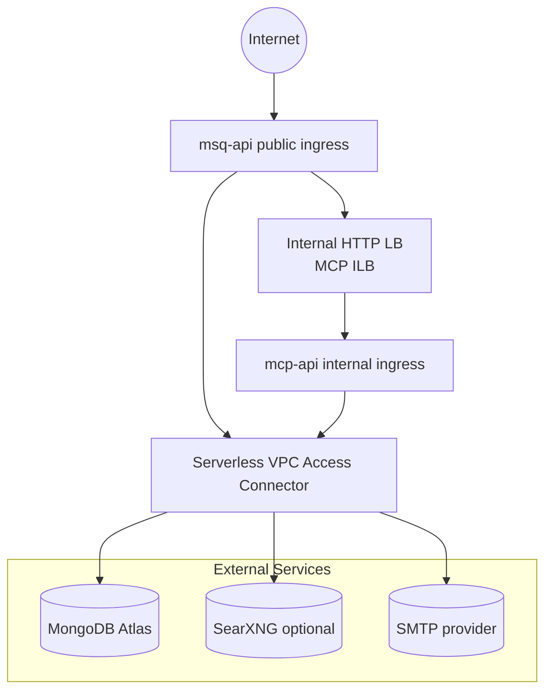
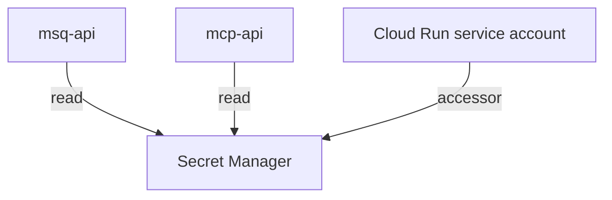
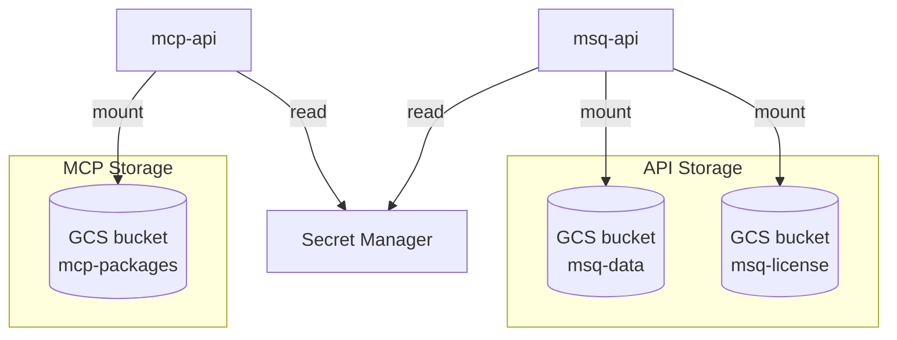
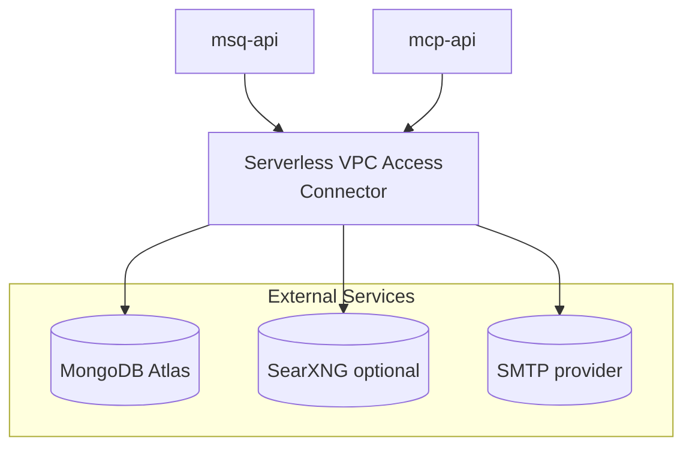
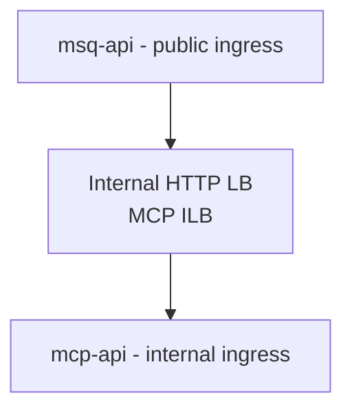
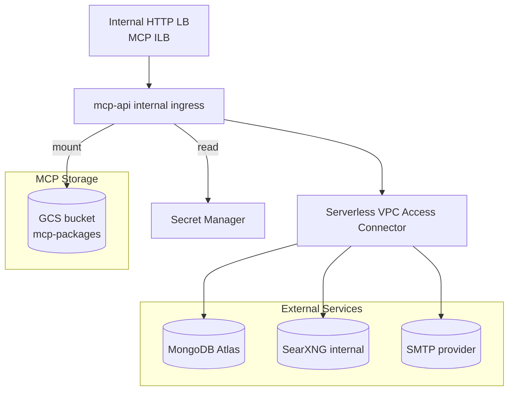
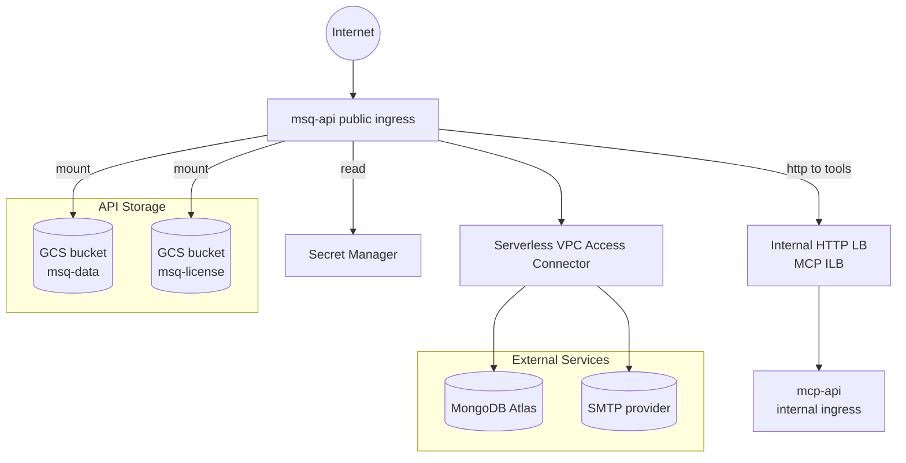
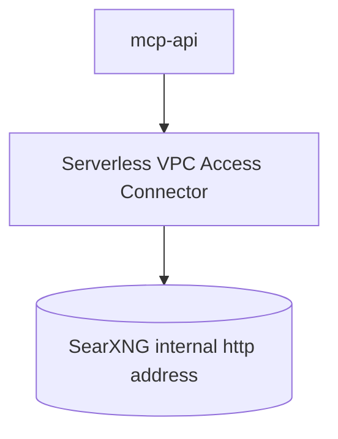

# Mission Squad Platform — Google Cloud Deployment

Audience: Cloud operators deploying the Mission Squad Platform on Google Cloud. This guide covers a production‑grade reference using:
- Cloud Run (Gen2) for stateless services
- Secret Manager for secrets
- Serverless VPC Access Connector for private egress (MongoDB Atlas peering or allow‑listed SRV)
- Internal HTTP Load Balancer (ILB) for MCP (stable internal IP)
- Cloud Storage buckets for persistent data mounts

This guide provides step-by-step commands to deploy the platform on Google Cloud with current images and environment settings. Enter all required secrets into Secret Manager before deploying.

Related:
- General Docker/Compose hosting: [Hosting](/hosting/)
- Platform UI: [Getting Started](/platform/getting-started)
- API Overview: [API](/api/)
- Endpoint Index: [Endpoint Index](/api/reference/endpoint-index)

## 1) Architecture


#### Overview



- Services
  - msq-api (public ingress): Mission Squad API, OpenAI‑compatible endpoints, vector stores/files/core.
  - mcp-api (internal ingress): MCP gateway (tools). Not publicly exposed.
- Networking
  - Serverless VPC Access Connector: allows Cloud Run private egress to VPC/IP ranges (MongoDB Atlas peering).
  - Internal HTTP LB (ILB): exposes mcp-api on a stable private IP. `msq-api` uses this IP via `TOOLS_HOST`.
- Storage
  - GCS buckets mounted into Cloud Run:
    - `/app/data` (API data)
    - `/app/data/license` (license artifacts)
    - `/app/packages` (MCP tool packages)
- Secrets
  - Secret Manager holds: `MONGO_PASS`, `USER_SECRET_KEY`, `JWT_SECRET`, `ADMIN_PASSWORD`, `SMTP_PASS`.
  - Cloud Run service account requires `roles/secretmanager.secretAccessor` on each secret.

<!-- Marketplace alignment checklist:
- Organization:
  - Join and remain in good standing with Google Cloud Partner Advantage and maintain a Cloud Marketplace vendor account and payment profile.
  - Incorporation in supported regions.
- Product:
  - Production‑ready (not alpha/beta), enterprise‑ready: professional site, documented support model, strong security practices (SBOMs, vuln scanning, patch cadence).
  - Same capabilities for Marketplace and non‑Marketplace offerings.
  - No malicious code; data products contain no “personally identifiable sensitive information” per PADFA 2024.
- Hosting on Google Cloud:
  - Pattern 1: Prefer deploying MongoDB Atlas on GCP with Private Service Connect or VPC peering (entire product runs on GCP).
  - Pattern 2: If external support services (e.g., SMTP, search, or off‑GCP Atlas) are used, ensure the Google Cloud–hosted compute/data plane is the usage driver as customers scale.
- Operational best practices:
  - Define SLOs, logging/monitoring with Cloud Logging/Monitoring, on‑call support processes.
  - Configure minimum instances to avoid cold starts; regular security updates to base images; rotate secrets via Secret Manager versions.
- Change control:
  - Re‑notify Google if changes affect compliance or previously submitted documentation. -->

## 2) Prerequisites

- gcloud CLI installed and authenticated.
- Project, region, and project number identified:
  ```bash
  export GCP_PROJECT="your-project-id"
  export REGION="us-west1"
  gcloud projects describe "$GCP_PROJECT" --format='value(projectNumber)'
  # set:
  export PROJECT_NUMBER="123456789012"
  ```
- MongoDB (Atlas recommended):
  - SRV URL or standard URI with replicaSet
  - Atlas VPC peering to your GCP project/VPC (recommended) or allow‑list Cloud Run egress IPs if public SRV.
- Domains (optional but recommended):
  - Custom domain mapping for `msq-api` (e.g., `api.your-domain.com`)
- Quotas:
  - Serverless VPC Access Connector quota
  - Internal HTTP LB proxy‑only subnet ranges available

Enable required APIs:
```bash
gcloud services enable compute.googleapis.com \
  vpcaccess.googleapis.com run.googleapis.com \
  secretmanager.googleapis.com --project="$GCP_PROJECT"
```

## 3) Versions and images

Recommended images (updated):
- missionsquad-api: `ghcr.io/missionsquad/missionsquad-api:1.40.0`
- mcp-api: `ghcr.io/missionsquad/mcp-api:1.7.0`

Options to reference images:
- Option A (simpler): Use GHCR tags directly in Cloud Run `--image=...`.
- Option B (recommended for enterprise): Mirror into Artifact Registry in your project:
  ```bash
  export AR_REGION="us-central1"
  export AR_REPO="msq"
  gcloud artifacts repositories create "$AR_REPO" --repository-format=docker \
    --location="$AR_REGION" --project="$GCP_PROJECT" || true

  docker pull ghcr.io/missionsquad/missionsquad-api:1.40.0
  docker pull ghcr.io/missionsquad/mcp-api:1.7.0

  docker tag ghcr.io/missionsquad/missionsquad-api:1.40.0 \
    "$AR_REGION-docker.pkg.dev/$GCP_PROJECT/$AR_REPO/missionsquad-api:1.40.0"
  docker tag ghcr.io/missionsquad/mcp-api:1.7.0 \
    "$AR_REGION-docker.pkg.dev/$GCP_PROJECT/$AR_REPO/mcp-api:1.7.0"

  docker push "$AR_REGION-docker.pkg.dev/$GCP_PROJECT/$AR_REPO/missionsquad-api:1.40.0"
  docker push "$AR_REGION-docker.pkg.dev/$GCP_PROJECT/$AR_REPO/mcp-api:1.7.0"
  ```
Use the AR image paths in the deploy step if you mirror.

## 4) Secrets (create first)

Create these Secret Manager secrets (names are examples; adjust as needed):
- `MONGO_PASS_PROD`
- `SECRETS_KEY_PROD`        (used for both MCP `SECRETS_KEY` and API `USER_SECRET_KEY`)
- `JWT_SECRET_PROD`
- `ADMIN_PASSWORD_PROD`
- `SMTP_PASS_PROD`

Example creation:
```bash
echo -n 'your-mongo-password' | gcloud secrets create MONGO_PASS_PROD --data-file=- --project="$GCP_PROJECT"
echo -n 'openssl rand -hex 32' | gcloud secrets create SECRETS_KEY_PROD --data-file=- --project="$GCP_PROJECT"
echo -n 'openssl rand -hex 32' | gcloud secrets create JWT_SECRET_PROD --data-file=- --project="$GCP_PROJECT"
echo -n 'your-admin-password' | gcloud secrets create ADMIN_PASSWORD_PROD --data-file=- --project="$GCP_PROJECT"
echo -n 'your-smtp-pass' | gcloud secrets create SMTP_PASS_PROD --data-file=- --project="$GCP_PROJECT"
```

Grant accessor role to the default compute service account (or your chosen deploy SA):
```bash
SA="${PROJECT_NUMBER}-compute@developer.gserviceaccount.com"
for S in MONGO_PASS_PROD SECRETS_KEY_PROD JWT_SECRET_PROD ADMIN_PASSWORD_PROD SMTP_PASS_PROD; do
  gcloud secrets add-iam-policy-binding "$S" \
    --member="serviceAccount:${SA}" \
    --role="roles/secretmanager.secretAccessor" \
    --project="$GCP_PROJECT"
done
```



## 5) Storage buckets and IAM



Choose bucket names (unique globally):
```bash
export ENVIRONMENT="prod"
export MCP_PACKAGE_BUCKET_NAME="${ENVIRONMENT}-mcp-packages"
export MSQ_DATA_BUCKET_NAME="${ENVIRONMENT}-msq-data"
export MSQ_LICENSE_BUCKET_NAME="${ENVIRONMENT}-msq-license"

gcloud storage buckets create "gs://$MCP_PACKAGE_BUCKET_NAME" --location="$REGION" --uniform-bucket-level-access --project="$GCP_PROJECT" || true
gcloud storage buckets create "gs://$MSQ_DATA_BUCKET_NAME" --location="$REGION" --uniform-bucket-level-access --project="$GCP_PROJECT" || true
gcloud storage buckets create "gs://$MSQ_LICENSE_BUCKET_NAME" --location="$REGION" --uniform-bucket-level-access --project="$GCP_PROJECT" || true

# Grant objectAdmin to the service account used by Cloud Run
for B in "$MCP_PACKAGE_BUCKET_NAME" "$MSQ_DATA_BUCKET_NAME" "$MSQ_LICENSE_BUCKET_NAME"; do
  gcloud storage buckets add-iam-policy-binding "gs://$B" \
    --member="serviceAccount:${SA}" \
    --role="roles/storage.objectAdmin" \
    --project="$GCP_PROJECT"
done
```

## 6) Networking (VPC connector and ILB subnets)

#### Internal VPC Networking



#### ILB Routing (msq-api → MCP)



Create/verify a Serverless VPC Access Connector:
```bash
export VPC_NETWORK="default"
export VPC_CONNECTOR_NAME="atlas-${ENVIRONMENT}"
export VPC_CONNECTOR_IP_RANGE="10.8.0.0/28" # adjust for your VPC

gcloud compute networks vpc-access connectors create "$VPC_CONNECTOR_NAME" \
  --network="$VPC_NETWORK" --region="$REGION" \
  --range="$VPC_CONNECTOR_IP_RANGE" --project="$GCP_PROJECT"
```

Internal HTTP LB (MCP):
- Two subnets required:
  - Proxy‑only subnet (purpose=REGIONAL_MANAGED_PROXY role=ACTIVE)
  - ILB endpoint subnet (normal subnet for ILB VIP)

```bash
export PROXY_SUBNET_RANGE="10.122.10.0/23"
export ILB_ENDPOINT_SUBNET_RANGE="10.122.50.0/23"
export ILB_IP_ADDRESS="10.122.50.11" # chosen IP inside ILB endpoint subnet

gcloud compute networks subnets create "${ENVIRONMENT}-proxy-only-lb-subnet" \
  --network="$VPC_NETWORK" --region="$REGION" \
  --range="$PROXY_SUBNET_RANGE" --purpose=REGIONAL_MANAGED_PROXY --role=ACTIVE \
  --project="$GCP_PROJECT"

gcloud compute networks subnets create "${ENVIRONMENT}-ilb-endpoint-subnet" \
  --network="$VPC_NETWORK" --region="$REGION" \
  --range="$ILB_ENDPOINT_SUBNET_RANGE" --project="$GCP_PROJECT"
```

## 7) Deploy MCP API (internal)

Set runtime configuration:
```bash
# Mongo / MCP app config
export MONGO_USER="missionsquad"
export MONGO_HOST="mongodb+srv://cluster.example.mongodb.net/?appName=Cluster0"
export REPLICA_SET="atlas-shard-0" # omit if using pure SRV without explicit rs
export MONGO_DBNAME="missionsquad"
export SECRETS_DBNAME="userSecrets"

# MCP runtime
export MCP_API_IMAGE="ghcr.io/missionsquad/mcp-api:1.7.0"
export MCP_API_CPU="4"
export MCP_API_MEMORY="8Gi"
export API_PORT="8080"
export MCP_INSTALL_ON_START="@missionsquad/mcp-github|github"
# Optional web search tools integration
export SEARXNG_URL="http://10.122.50.12" # if deployed; otherwise omit or set to internal SearXNG
```



Deploy:
```bash
gcloud run deploy "${ENVIRONMENT}-mcp-api" \
  --image="$MCP_API_IMAGE" \
  --platform=managed --region="$REGION" \
  --cpu="$MCP_API_CPU" --cpu-boost --memory="$MCP_API_MEMORY" \
  --port="$API_PORT" --min=1 \
  --execution-environment=gen2 \
  --vpc-connector="$VPC_CONNECTOR_NAME" --vpc-egress=private-ranges-only \
  --ingress=internal \
  --set-env-vars="MONGO_USER=${MONGO_USER},REPLICA_SET=${REPLICA_SET},MONGO_HOST=${MONGO_HOST},MONGO_DBNAME=${MONGO_DBNAME},SECRETS_DBNAME=${SECRETS_DBNAME},INSTALL_ON_START=${MCP_INSTALL_ON_START},SEARXNG_URL=${SEARXNG_URL}" \
  --update-secrets="MONGO_PASS=MONGO_PASS_PROD:latest,SECRETS_KEY=SECRETS_KEY_PROD:latest" \
  --add-volume=name=mcp-packages,type=cloud-storage,bucket="${MCP_PACKAGE_BUCKET_NAME}" \
  --add-volume-mount=volume=mcp-packages,mount-path=/app/packages \
  --startup-probe="httpGet.path=/healthz,initialDelaySeconds=15,periodSeconds=60,timeoutSeconds=10,failureThreshold=3" \
  --liveness-probe="httpGet.path=/healthz,initialDelaySeconds=30,periodSeconds=120,timeoutSeconds=5,failureThreshold=3" \
  --project="$GCP_PROJECT"
```

Create ILB to expose a stable internal IP for MCP:

```bash
# Serverless NEG → Backend Service → URL Map → Target HTTP Proxy → Forwarding Rule
gcloud compute network-endpoint-groups create "${ENVIRONMENT}-mcp-ilb-neg" \
  --network-endpoint-type=serverless \
  --cloud-run-service="${ENVIRONMENT}-mcp-api" \
  --region="$REGION" --project="$GCP_PROJECT"

gcloud compute backend-services create "${ENVIRONMENT}-mcp-ilb-bs" \
  --load-balancing-scheme=INTERNAL_MANAGED --protocol=HTTP \
  --region="$REGION" --project="$GCP_PROJECT"

gcloud compute backend-services add-backend "${ENVIRONMENT}-mcp-ilb-bs" \
  --network-endpoint-group="${ENVIRONMENT}-mcp-ilb-neg" \
  --network-endpoint-group-region="$REGION" \
  --region="$REGION" --project="$GCP_PROJECT"

gcloud compute url-maps create "${ENVIRONMENT}-mcp-ilb-urlmap" \
  --default-service="${ENVIRONMENT}-mcp-ilb-bs" \
  --region="$REGION" --project="$GCP_PROJECT"

gcloud compute target-http-proxies create "${ENVIRONMENT}-mcp-ilb-proxy" \
  --url-map="${ENVIRONMENT}-mcp-ilb-urlmap" \
  --region="$REGION" --project="$GCP_PROJECT"

gcloud compute forwarding-rules create "${ENVIRONMENT}-mcp-ilb-fr" \
  --load-balancing-scheme=INTERNAL_MANAGED \
  --network="$VPC_NETWORK" --subnet="${ENVIRONMENT}-ilb-endpoint-subnet" \
  --region="$REGION" --ip-protocol=TCP --ports=80 \
  --address="$ILB_IP_ADDRESS" --allow-global-access \
  --target-http-proxy="${ENVIRONMENT}-mcp-ilb-proxy" \
  --target-http-proxy-region="$REGION" \
  --project="$GCP_PROJECT"
```

Record the ILB IP; you will use it in `TOOLS_HOST` for the API.

## 8) Deploy Mission Squad API (public)

Set runtime configuration:
```bash
export MSQ_API_IMAGE="ghcr.io/missionsquad/missionsquad-api:1.40.0"
export MSQ_API_CPU="2"
export MSQ_API_MEMORY="4Gi"

# Admin/bootstrap
export ADMIN_USERNAME="admin"
export ADMIN_EMAIL="admin@your-domain.com"

# Operational defaults
export DEBUG="false"
export SCRAPE_WITH_GPU="false"
export PAGE_CACHE_MAX="1000"
export ENABLE_NGINX="false" # not used on Cloud Run

# MCP and SMTP
export TOOLS_HOST="http://${ILB_IP_ADDRESS}"
export TOOL_SECRETS="github|github_pat"
export SMTP_HOST="smtp.gmail.com"
export SMTP_PORT="465"
export SMTP_USER="noreply@your-domain.com"
export SMTP_SECURE="true"

# CORS
export ALLOWED_ORIGINS="https://your-ui.your-domain.com|https://your-run-url-optional"

# Optional embedding default (recommended to set explicitly at first model save)
# export DEFAULT_EMBEDDING_MODEL="text-embedding-3-small"
```



Deploy:
```bash
gcloud run deploy "${ENVIRONMENT}-msq-api" \
  --image="$MSQ_API_IMAGE" \
  --platform=managed --region="$REGION" \
  --cpu="$MSQ_API_CPU" --memory="$MSQ_API_MEMORY" \
  --port="$API_PORT" --min=1 \
  --execution-environment=gen2 \
  --vpc-connector="$VPC_CONNECTOR_NAME" --vpc-egress=private-ranges-only \
  --ingress=all \
  --set-env-vars="ADMIN_USERNAME=${ADMIN_USERNAME},ADMIN_EMAIL=${ADMIN_EMAIL},MONGO_USER=${MONGO_USER},REPLICA_SET=${REPLICA_SET},MONGO_HOST=${MONGO_HOST},MONGO_DBNAME=${MONGO_DBNAME},ENABLE_NGINX=${ENABLE_NGINX},DEBUG=${DEBUG},SCRAPE_WITH_GPU=${SCRAPE_WITH_GPU},PAGE_CACHE_MAX=${PAGE_CACHE_MAX},TOOLS_HOST=${TOOLS_HOST},TOOL_SECRETS=${TOOL_SECRETS},SMTP_HOST=${SMTP_HOST},SMTP_PORT=${SMTP_PORT},SMTP_USER=${SMTP_USER},SMTP_SECURE=${SMTP_SECURE},ALLOWED_ORIGINS=${ALLOWED_ORIGINS}" \
  --update-secrets="MONGO_PASS=MONGO_PASS_PROD:latest,USER_SECRET_KEY=SECRETS_KEY_PROD:latest,JWT_SECRET=JWT_SECRET_PROD:latest,ADMIN_PASSWORD=ADMIN_PASSWORD_PROD:latest,SMTP_PASS=SMTP_PASS_PROD:latest" \
  --add-volume=name=msq-data,type=cloud-storage,bucket="${MSQ_DATA_BUCKET_NAME}" \
  --add-volume=name=msq-license,type=cloud-storage,bucket="${MSQ_LICENSE_BUCKET_NAME}" \
  --add-volume-mount=volume=msq-data,mount-path=/app/data \
  --add-volume-mount=volume=msq-license,mount-path=/app/data/license \
  --startup-probe="httpGet.path=/healthz,initialDelaySeconds=15,periodSeconds=60,timeoutSeconds=10,failureThreshold=3" \
  --liveness-probe="httpGet.path=/healthz,initialDelaySeconds=30,periodSeconds=120,timeoutSeconds=5,failureThreshold=3" \
  --project="$GCP_PROJECT"
```

Obtain URLs:
```bash
gcloud run services describe "${ENVIRONMENT}-msq-api" --region="$REGION" --format='value(status.url)' --project="$GCP_PROJECT"
# MCP is internal behind the ILB IP you set, e.g., http://10.122.50.11
```

## 9) CORS, domains, and UI

- Set `ALLOWED_ORIGINS` to include your UI origin(s). If you use the hosted Platform UI, add that origin. For Cloud Run URL testing, include the run.app URL exactly.
- Optional: map a custom domain to the Cloud Run `msq-api` service and update `ALLOWED_ORIGINS` accordingly.
- The UI can connect to your API base URL; API key format is `msq-...`.

## 10) Verify

```bash
# Models list (OpenAI-compatible)
curl -s "$(gcloud run services describe ${ENVIRONMENT}-msq-api --region=$REGION --format='value(status.url)' --project=$GCP_PROJECT)/v1/models" | head

# Health checks
curl -s "$(gcloud run services describe ${ENVIRONMENT}-msq-api --region=$REGION --format='value(status.url)' --project=$GCP_PROJECT)/healthz"
```

Sign in to the Platform UI with `ADMIN_USERNAME` and `ADMIN_PASSWORD` (from Secret Manager). Change the admin password after first login.

## 11) Operations

- Logs:
  ```bash
  gcloud run logs read "${ENVIRONMENT}-msq-api" --region="$REGION" --project="$GCP_PROJECT"
  gcloud run logs read "${ENVIRONMENT}-mcp-api" --region="$REGION" --project="$GCP_PROJECT"
  ```
- Scaling:
  - Start with `--min=1` for both services for cold‑start avoidance.
  - Adjust CPU/memory to workload: typical ranges are 2–4 vCPU, 4–8Gi.
- Upgrades:
  - Deploy a new image tag via `gcloud run deploy` with updated `--image`.
  - Keep previous revision for rollback.
- Backups:
  - Database: use MongoDB backups/snapshots per Atlas policy.
  - Buckets: versioning or scheduled object backups if required.

## 12) Optional: SearXNG (web search tools)

If you need the web search MCP tools:
- Deploy SearXNG on GCP and set `SEARXNG_URL` for MCP.
- Deploy SearXNG on GCE, Cloud Run, or within your VPC, expose it at an internal HTTP address, and set `SEARXNG_URL` to that address (for example, `http://10.122.50.12`).
- Ensure MCP egress can reach SearXNG over VPC/IP; if internal, provide an internal address.



## 13) Troubleshooting

- SecretManager denied:
  - Ensure `${PROJECT_NUMBER}-compute@developer.gserviceaccount.com` (or your run SA) has `roles/secretmanager.secretAccessor` on each secret.
- VPC connector creation errors:
  - IP range conflicts or quotas; choose a non‑overlapping `/28` and check `vpcaccess` quota.
- ILB conflicts:
  - Ensure proxy‑only subnet and ILB endpoint subnet do not overlap existing ranges.
- MongoDB connectivity:
  - With SRV + peering, keep `--vpc-egress=private-ranges-only`.
  - For public SRV, consider `all-traffic` egress and allow‑list Cloud Run egress IPs in Atlas (less secure).
- CORS:
  - `ALLOWED_ORIGINS` must include exact scheme + host origins.
- Streaming hangs (SSE):
  - For any proxies in front of Cloud Run, disable buffering and set `X-Accel-Buffering: no`.

## 14) Cleanup

Cleanup steps (run as needed):
- Delete forwarding rule → target proxy → URL map → backend service → NEG.
- Remove subnets if no longer needed.
- Delete buckets (with care) and secrets when appropriate.

---
Notes on environment updates in this guide:
- Images updated to: `missionsquad-api:1.40.0`, `mcp-api:1.7.0`.
- `DEFAULT_EMBEDDING_MODEL` is optional; recommend setting provider/model explicitly via the Platform.
- `SKIP_CLEAN_MODEL_NAMES` is omitted by default; treat as an advanced tuning flag if needed.
