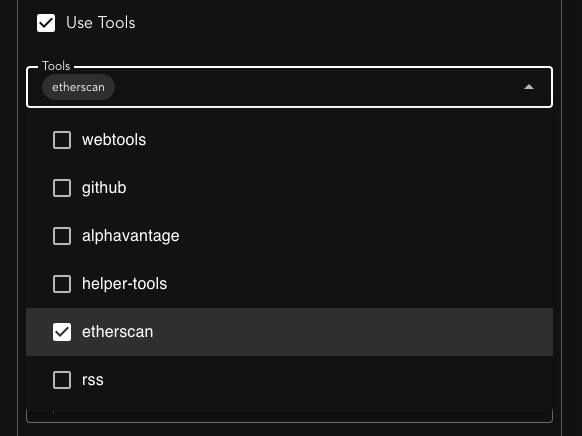
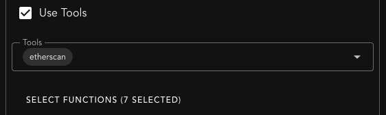
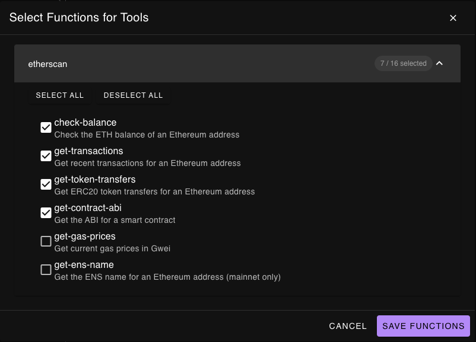
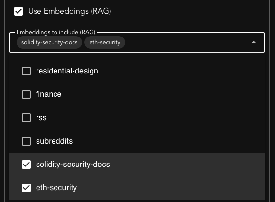
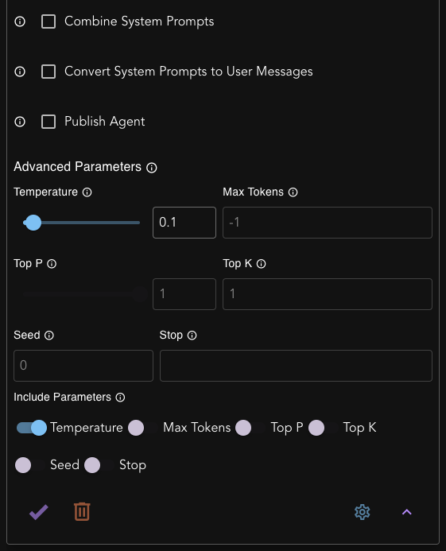

# Agents

Purpose: Specialize a model with a system prompt, optional tools, and optional RAG.

## Key fields

1) Agent Name / Description — used for lookup in lists and in the API (`model: "<agent-name>"`).  
2) Agent Prompt — your system prompt (persona, rules, success criteria).  
3) Agent Model — pick the named model you saved on the Models screen.  
4) Use Tools (MCP) — enable and then pick specific servers and functions the agent may call. Principle of least privilege.  
5) Use Embeddings (RAG) — toggle and select one or more collections to search and inject into the agent’s context.  
6) Publish Agent (coming soon) — exposes to your account’s shared lists (and, if enabled elsewhere, to Slack). Not public outside your account and shared list.

## Tool selection

  

    When you enable Use Tools (MCP), you can select specific MCP Servers and functions the agent may call. In the dropdown, each item corresponds to an MCP Server. If no specific functions are selected, all functions will be provided to the model to use.
  

  

  

    You may optionally refine the tools that are provided to the model. Some servers have many tools, and you may not want to provide all of them to the model. Too many available tools will waste tokens and could cause the model to make choices that may not be aligned with your intentions. Click "Select Functions" to choose the functions you want to make available to your agent.
  

  

    
    
  

## Embedding Collections (RAG)

  

    After you upload documents to the platform, you can select which collections you want to make available to your agent.
  

  

## Advanced Options

  <ul>
    <li>
      <h3>Combine System Prompts</h3>
      When enabled, the agent's system prompt will be combined with any system prompts passed in from external tools. The agent's prompt comes first.
    </li>
    <li>
      <h3>Convert System Prompts to User Messages</h3>
      When enabled, any additional system prompts from external tools will be converted to user messages instead of being treated as system prompts.
    </li>
    <li>
      <h3>Advanced Parameters</h3>
      When set, you can override the model's default parameters for this agent.
    </li>
  </ul>
  

## Design guidance

- Keep prompts explicit about sources of truth and cite/tool behavior (e.g., “always ground answers in RAG or tool output”).  
- Create separate agents per job: e.g., `web-news-finance` vs `code-reviewer`.  
- Parameter overrides (if supported) live here when you need behavior different from the base model config.

## API parity

- List: `GET /v1/core/agents`  
- Add/update: `POST /v1/core/add/agent`  
- Delete: `POST /v1/core/delete/agent`  
- Run via OpenAI‑compatible chat: `POST /v1/chat/completions` with `model: "<agent-name>"`  
See [Agents](/api/reference/agents) and [Chat Completions](/api/reference/chat-completions)

